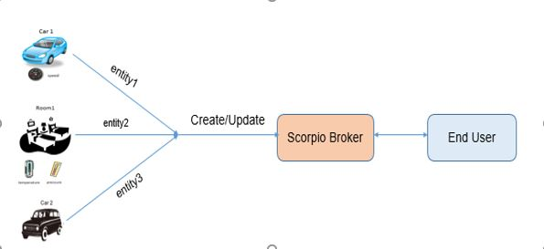

***************
Batch Operation
***************

Batch operation use when multiple entities would be created by user.

Batch queries support following operations:

1. Create multiple entities 
2. Upsert multiple entity 
3. Update multiple entity 
4. Delete multiple entity.
  
For example: take a car as a entity1 and another car as a entity2 and room as a entity3.all have some attributes in case of car brand name and speed are an attribute and in case of room temperature is attribute so we can create/update all the entities by single request through the entity batch operation support.

These are the batch operation API’s.

 - /ngsi-ld/v1/entityOperations/create/

   Create multiple entities

 - /ngsi-ld/v1/entityOperations/upsert/

   Create multiple entity and also update the existing entity

 - /ngsi-ld/v1/entityOperations/update/

   Update only existing entities

 - /ngsi-ld/v1/entityOperations/delete/

   Delete existing entities

Batch Operation Response Codes
##############################
We adapted the Batch Operations Response Codes to better align with the non-Batch versions and to better reflect the cases where the operation was successful only for some of the individual requests in the batch (207).  

.. list-table::  **Batch Operation Response Codes** 
   :widths: 20 20 20 20 20
   :header-rows: 1

   * - Code	
     - Create 		 
     - Upsert
     - Update
     - Delete
      
   * - 201 Created
     - If all entities have been successfully created.								
     - If all entities not existing prior to request have been successfully created and others successfully updated.
     - N/A
     - N/A

   * - 204 No content
     - N/A							
     - If all entities previously existed and are successfully updated.
     - If all entities have been successfully updated.
     - If all entities already existed and have been successfully deleted.

   * - 207 Multi Status
     - If only some entities have been successfully created.
     - If only some or none of the entities have been successfully created or updated.
     - If only some or none of the entities have been successfully updated.
     - If some or all of the entities have not been successfully deleted, or did not exist.

   * - 400 Bad Request
     - If the request or its content is incorrect.
     - If the request or its content is incorrect.
     - If the request or its content is incorrect.
     - If the request or its content is incorrect.
	 
	 
API Walkthrough
#################

1. **http://<IP Address>:<port>/ngsi-ld/v1/entityOperations/create/**
Body:
::

 [
  {
		"id": "urn:ngsi-ld:Vehicle:A101",
		"type": "Vehicle",
		"brandName": {
			"type": "Property",
			"value": "Mercedes"
		},
		"speed": {
			"type": "Property",
			"value": 80
		}
	},
	{
		"id": "urn:ngsi-ld:Vehicle:A102",
		"type": "Vehicle",
		"brandName": {
			"type": "Property",
			"value": "SUZUKI"
		},
		"speed": {
			"type": "Property",
			"value": 81
		}
	}
  ]

2. **http://<IP Address>:<port>/ngsi-ld/v1/entityOperations/upsert/**
Body:
::

 [
  {
		"id": "urn:ngsi-ld:Vehicle:A101",
		"type": "Vehicle",
		"brandName": {
			"type": "Property",
			"value": "BMW"
		},
		"speed": {
			"type": "Property",
			"value": 95
		}
	},
	{
		"id": "urn:ngsi-ld:Vehicle:A102",
		"type": "Vehicle",
		"brandName": {
			"type": "Property",
			"value": "SUZUKI"
		},
		"speed": {
			"type": "Property",
			"value": 85
		}
	},
  {
		"id": "urn:ngsi-ld:Vehicle:A103",
		"type": "Vehicle",
		"brandName": {
			"type": "Property",
			"value": "MARUZI"
		},
		"speed": {
			"type": "Property",
			"value": 68
		}
	}
 ]

3. **http://<IP Address>:<port>/ngsi-ld/v1/entityOperations/update/**
Body:
::

 [
  {
		"id": "urn:ngsi-ld:Vehicle:A101",
		"type": "Vehicle",
		"brandName": {
			"type": "Property",
			"value": "Porsche"
		},
		"speed": {
			"type": "Property",
			"value": 95
		}
	},
	{
		"id": "urn:ngsi-ld:Vehicle:A102",
		"type": "Vehicle",
		"brandName": {
			"type": "Property",
			"value": "SUZUKI"
		},
		"speed": {
			"type": "Property",
			"value": 87
		}
	}
 ]

4. **http://<IP Address>:<port>/ngsi-ld/v1/entityOperations/delete/**
Body:
::

 [
	"urn:ngsi-ld:Vehicle:A101",
	"urn:ngsi-ld:Vehicle:A102"
 ]
