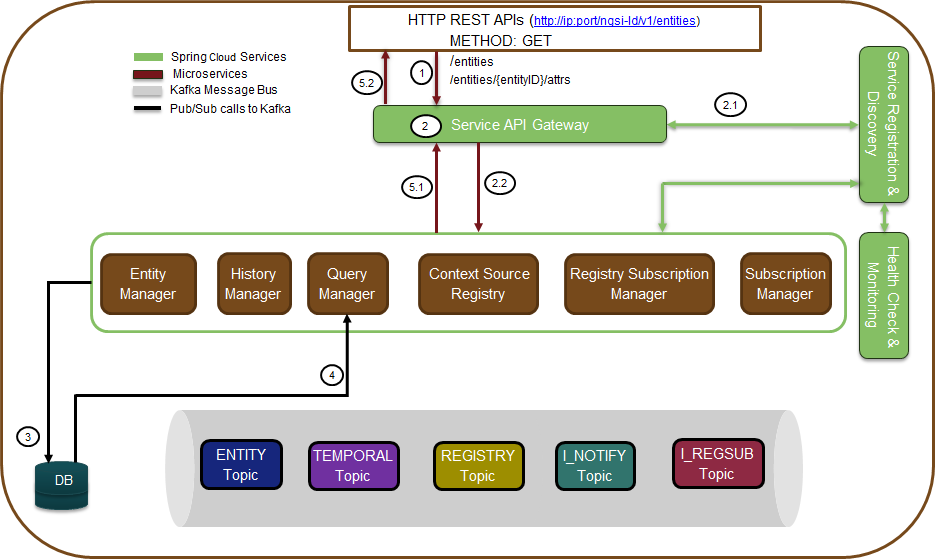
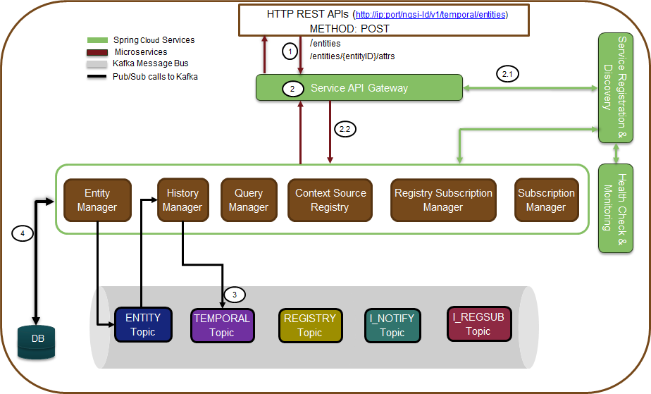

***************
Operation flows
***************

Entity Create/Update/Append
###########################

.. figure:: figures/flow-1.png

The Figure is showing the operational flow of entity create/update/append in the Scorpio Broker system. Following are the marked steps interpretation:

1. An application calls the NGSI-LD compliant interface (exposed by service API gateway) to create/update/append an entity in the form of the HTTP POST request.

2. The request enters in service API gateway.

 2.1. The service API gateway discovers the actual serving micro-service endpoints (where the incoming requests need to be forwarded) from discovery & registry service.

 2.2. The service API gateway forwards the HTTP request to the Entity Manager micro-service.
   
3. The entity Manager internally calls an LDContext resolver service to resolve the payload with the given context sent along with the POST request. Once the payload is resolved with context, it now fetches the previously stored data/entities from the Topic “Entities” and validates the requested entity against the existing stored entities based on EntityID.

- If the entity is already present (or with all the attributes and values that are requested to be modified), an error message (“already exists”) will be responded for the same and no further step will be executed. 

- Else it will move for further processing. 

4. The Entity Manager (EM) will do publish/store and send the response to the requester for the requested Entity(E1) creation operation given as follows:

 4.1.EM publishes the E1 in the Kafka under Topic “Entities”.

 4.2.EM publishes the E1 in the Kafka under Topic “Entity_Create/Update/Append” as well.

 4.3. Upon successful pub operation, EM will send the response back.

**Note**: “Entities” topic will save all changes of an entity done over a period of time by any of the create/update/append operations of an entity. However, “Entity_Create/Update/Append” Topic (specific to CREATE operation) will only store the data changes of entity create operation only. Having different topics per operation will avoid ambiguity situations among different consumers different requirements. E.g. the subscription manager may need to subscribe for the whole entity, a set of specific attributes, or might be some value change of certain attributes. So, managing all these requirements would be hard if a separate topic per operation is not maintained and would be very simplified to provide direct delta change in data for the given entity at any point in time if separate topics per operation are maintained. Therefore, putting all operations data in a single topic cannot offer the required decoupling, simplification, and flexibility to subscribe/manage at operations, data, or delta data level requirements. 
So that’s why creating separate topics per operation and one common topic for recording all changes (require to validate the whole entity changes for all operations over a period of time) of all operations to the given entity is the favorable design choice.
The context for the given payload is being stored by the LDContext resolver service in the Kafka topic under the name AtContext.   

5. When a message gets published to Kafka Topics, the consumers of that topic will get notified who has subscribed or listening to those topics. In this case, the consumers of “Entity Create/Update/Append” topic upon receiving notification will do the following:

 5.1. Subscription Manager when getting a notification for the related entity it will check for the notification validation for the current entity and checks if the notification needs to be sent accordingly.

 5.2. Storage Manager, upon notification from Entities & CR Topics, will trigger the further operations to store/modify the entity related changes in the DB tables. 

6. Now entity manager also prepares for registration of the entity data model in the Context Registry. Following are the further functions it performs to achieve the same:

 6.1. So it prepares the csource registration payload (as per NGSI_LD spec section C.3) from the entity payload and fills the necessary field (like id, endpoint as broker IP, location, etc.). Afterword entity manager writes this created csource payload in the CR Topic.

 6.2.CR Manager listens to this CR topic and then able to know that some entity has registered.

 6.3.CR manager writes the updates, if any are there, into the Csource Topic.  

Entity Subscription
###################

.. figure:: figures/flow-2.png

The Figure is showing the operational flow of entity subscription in the Scorpio Broker system. Following are the marked steps interpretation:

1. An application calls the NGSI-LD compliant interface (exposed by service API gateway) to subscribe for an entity (or attribute) in the form of the HTTP POST request.

2. The request enters in service API gateway.

 2.1. The service API gateway discovers the actual serving micro-service endpoints (where the incoming requests need to be forwarded) from discovery & registry service.

 2.2. The service API gateway forwards the HTTP request to the Subscription Manager micro-service.
   
3. The Subscription Manager internally calls an LDContext resolver service to resolve the payload with the given context sent along with the POST request. The subscription manager then fetches the previously stored data/entities from the Topic “Subscription” and validates the requested entity against the existing stored values based on EntityID.

- If the data for the current request is already present, an error message will be responded for the same and no further step will be executed. 

- Else it will move for further processing. 

4. The Subscription Manager (SM) will publish/store and send the response to the requestor for the requested operation given as follows:

 4.1.SM publish the subscription S(E1) in the Kafka under Topic “Subscription” 

 4.2.SM will start the notification functionality and will start/keep listening for related subscription on.

 4.2.1. Entity related topics “Create/Update/Append”

 4.2.2.Context source related topic i.e. “CSource” topic for any future registration of context sources. Doing this it avoids the need to query CR explicitly for csources for already subscribed items/entities.

 4.2.3.CRQueryResult Topic for gathering results of the raised specific queries, if any are there.

 4.2.4. Upon successful subscription condition of subscription request, SM will notify the subscribed entity to the given endpoint back. And also do the remote subscriptions to the context sources provided by the context registry.

 4.3. Upon successful pub operation, SM will send the response back 
   
5.SM optionally may raise the query to CR by posting in the CRQuery Topic for each of the subscription requests received (only once per each subscription request). When a message gets published to CRQuery Topic, the consumer CR will be notified who has subscribed or listening on this topic. Now, CR will do the following:

 5.1. CR will receive the notification and checks for the list of context sources by pulling data from CR Topic and/or CSourceSub Topic for whom this subscription may valid.

 5.2.CR publishes the list of context sources into the CRQueryResult topic upon which the SM would have already started listening and repeat steps 4.2.3 and 4.2.4.

**Note**: CSource Topic will contain the list of context sources registered through Csource registration interface directly. CR Topic will contain the map of Entity Data model (maintained as an entity ID) created based on entity creation request (through IoT broker interface) and/or provider/data source of that entity model. 
Limitation: In the first release of Scorpio Broker, Csource query is not supported instead csource query is based on the internal messaging queue mechanism. In the future, both the message queue and Rest based csource query would be supported.

Query
#####

The Figure is showing the operational flow of entity subscription in the Scorpio Broker system. Following are the marked steps interpretation:

1. An application calls the NGSI-LD compliant interface (exposed by service API gateway) to query for entities/an entity/attribute in the form of an HTTP GET request.

2. The request enters in service API gateway.

 2.1. The service API gateway discovers the actual serving micro-service endpoints (where the incoming requests need to be forwarded) from discovery & registry service.

 2.2. The service API gateway forwards the HTTP request to the Query Manager micro-service.
   
3. The query manager now fetches the previously stored data/entities from the Topic “Entities”.

- If the query is for all entities or specific entities with id and/or attribute is requested, this will be directly served based on Kafka Entity topic data by query manager without involving the storage manager. In short simpler queries like non-geo queries or without regular expression queries associated with entity or entities can be served directly. In this case, the response will be sent back and processing jumps to step 7.2.

- For complex queries, the query manager will take help from the storage manager as mention in the following steps. 

4. The Query Manager (in case of complex queries) will publish the query (embedding a used in the message and other metadata) into the Query topic which is being listened by the Storage manager.

5. The storage manager gets the notification for the requested query and starts processing the query over the DB data and builds the query response.

6. The storage manager publishes the response of query in the Query topic which is being listened by Query manager.

7. The QM receives the notification from the QueryResult topic. 

 7.1.  It sends the HTTP response back to the API gateway.

 7.2.API gateway sends back the response to the end-user/requestor.

Context Source Registration
###########################

.. figure:: figures/flow-4.png

The Figure is showing the operational flow of context source registration in the Scorpio Broker system. Following are the marked steps interpretation:

1. An application calls the NGSI-LD compliant interface (exposed by service API gateway) to csource registration for in the form of an HTTP POST request.

2. The request enters in service API gateway.

 a. The service API gateway discovers the actual serving micro-service endpoints (where the incoming requests need to be forwarded) from discovery & registry service.

 b.The service API gateway forwards the HTTP request to the Context Registry (CR) Manager micro-service.   

3. The CR manager now fetches the previously stored data/entities from the Topic “CSource”.

 a. If the entry for the request csource is already present it exits the processing and informing the same to the requester. If it is not present, then it continues for further processing.

 b.Now the CR manager performs some basic validation to check if this is a valid request with the valid payload. 

 c.CR manager now writes this payload into the Csoure Topic.

4. The Storage Manager will keep listening for the Csource topic and for any new entry write it perform the relative operation in the database. 

5. The CR manager prepares the response for csource request and

 5.1 sends the Http response back to the API gateway.

 5.2 API gateway sends back the response to the end-user/requester.

**Note**: For Conext Source Update request only the payload will get changes and in step 3 upon validation for the existing entity it will not exit rather it will update the retrieved entity and write it back into the Kafka. The rest of the flow will remain mostly the same. 

Context Source Subscription
###########################

.. figure:: figures/flow-5.png

The Figure Scorpio Broker Context Source Subscription Flow is showing the operational flow of context source subscriptions in the Scorpio Broker system. Following are the marked steps interpretation:

1. An application calls the NGSI-LD compliant interface (exposed by service API gateway) to csource updates in the form of an HTTP POST request.

2. The request enters in service API gateway.

 a. The service API gateway discovers the actual serving micro-service endpoints (where the incoming requests need to be forwarded) from discovery & registry service.

 b.The service API gateway forwards the HTTP request to the Context Registry (CR) Manager micro-service.
   
3. The CR manager now fetches the previously stored data/entities from the Topic “CSourceSub”.

 a. Now the CR manager performs some basic validation to check if this is a valid request with the valid payload. 

 b.If the entry for the request csource subscription is already present it exits the processing and informing the same to the requester. If it is not present, then it continues for further processing.

 c.CR manager now writes this payload into the CsourceSub Topic.

 d.In parallel, it will also start an independent thread to listen Csource Topic for the requested subscription and upon the successful condition, the notification will be sent to the registered endpoint provided under subscription payload.

4. The Storage Manager will keep listening for the CsourceSub topic and for any new/updated entry write it perform the relative operation in the database. 

5. The CR manager prepares the response for csource subscription request and

 5.1 sends the Http response back to the API gateway.

 5.2 API gateway sends back the response to the end-user/requester.

History
#######

The Figure is showing the operational flow of entity subscription in the Scorpio Broker system. Following are the marked steps interpretation:

1. An application calls the NGSI-LD compliant interface (exposed by service API gateway) to the history manager in the form of an HTTP POST request.

2. The request enters in service API gateway.

 a. The service API gateway discovers the actual serving micro-service endpoints (where the incoming requests need to be forwarded) from discovery & registry service.

 b.The service API gateway forwards the HTTP request to the History Manager micro-service.   

3. The history manager now executes the EVA algorithm approach on the received payload and push payload attributes to Kafka topic “TEMPORALENTITY”.

**Note**: History Manager must walk through each attribute at the root level of the object (except @id and @type). Inside each attribute, it must walk through each instance (array element). Then, it sends the current object to the Kafka topic TEMPORALENTITY.

4. The history manager will keep listening to the “TEMPORALENTITY” topic and for any new entry and performs the relative operation in the database.