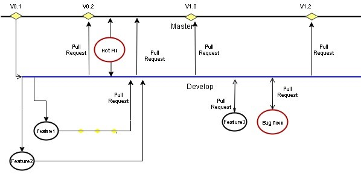

***********************
Contribution guidelines
***********************

Branch Management Guidelines
############################

The community can have two main branches with an infinite lifetime:

1.  **Master branch**: This is a highly stable branch that is always
    production-ready and contains the last release version of source
    code in production.
2.  **Development branch**: Derived from the master branch, the
    development branch serves as a branch for integrating different
    features planned for an upcoming release. This branch may or may not
    be as stable as the master branch. It is where developers
    collaborate and merge feature branches. All of the changes should be
    merged back into the master somehow and then tagged with a release
    number.

Apart from those two primary branches, there are other branches in the
workflow:

-   **Feature Branch**: Forked from the development branch for feature
    development i.e. enhancement or documentation. Merged back to the
    development branch after feature development or enhancement
    implementation.
-   **Bug Branch**: Ramify from the development branch. Merged back to
    the development branch after bug fixing.
-   **Hotfix branch**: Hotfix branches are created from the master
    branch. It is the current production release running live and
    causing troubles due to a severe bug. But changes in development are
    yet unstable. We may then branch off a hotfix branch and start
    fixing the problem. It should be the rarest occasion, in case only
    critical bugs.

**Note**: Only NLE and NECTI members have the privilege to create and
merge the Hotfix branch.

+------------------+-------------------------------------------------------------------------------------------------------------------------+----------------------------------------------------------------------------------------------------+
| Branch           | Branches naming guideline                                                                                               | Remarks                                                                                            |
+==================+=========================================================================================================================+====================================================================================================+
| Feature branches | Must branch from: *development*. Must merge back into: *development*. Branch naming convention: *feature-feature_id*    | *feature_id* is the Github issue id from **https://github.com/ScorpioBroker/ScorpioBroker/issues** |
+------------------+-------------------------------------------------------------------------------------------------------------------------+----------------------------------------------------------------------------------------------------+
| Bug Branches     | Must branch from: *development*. Must merge back into: *development*. Branch naming convention: *bug-bug_id*            | *bug_id* is the Github issue id from **https://github.com/ScorpioBroker/ScorpioBroker/issues**     |
+------------------+-------------------------------------------------------------------------------------------------------------------------+----------------------------------------------------------------------------------------------------+
| Hotfix Branches  | Must branch from: *master branch*. Must merge back into: *master branch*. Branch naming convention: *hotfix-bug number* | *Bug number* is the Github issue id from **https://github.com/ScorpioBroker/ScorpioBroker/issues** |
+------------------+-------------------------------------------------------------------------------------------------------------------------+----------------------------------------------------------------------------------------------------+

Permissions to the branches
***************************

-   **Master** - We tend to very strict that only NLE members and
    privileged members of NECTI can merge on the Master branch and
    accept the pull requests. Pull requests to master can be raised by
    only NECTI OR NLE members.
-   **Development** - Any community member can raise the pull request to
    the development branch but it should be reviewed by NLE or NECTI
    members. Development branches commits will be moved to the master
    branch only when all the test cases written under NGSI-LD test
    suites, will run successfully.

