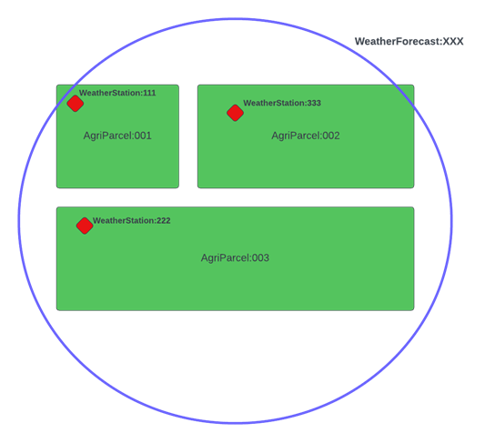

*********************************
Follow Relationships in a Query
*********************************

Follw Relationships in a Query is a feature that aims to allow us to retrieve entities with their linked sub-entities' data using the join parameter.
The join parameter has two supported values: *inline* and *flat*
	- If join=inline, the entity and sub-entities should be represented in a hierarchical structure.
	- If join=flat, the entity and sub-entities should be represented as they are currently, but target entities will be returned in the result list.

For example:  a person holds several pieces of land type:AgriParcel. Each AgriParcel has some of its own attributes, e.g., soilType, cropType. Each AgriParcel also has its own related weather station (i.e., Relationship to an entity type:WeatherObserved) displaying values holding to current observed weather conditions. We also require a weather forecast (i.e. Relationship to an entity type:WeatherForecast) which covers a wider area encompassing multiple AgriParcels for a predicted weather conditions.

**Note:** The join parameter is compatible with the option parameter in all scenarios including - normalized and concise.

Example for Follow Relationship in a Query
---------------------------------------------

1. Create Operation
=========================
In order to create the entities, we can hit the endpoint **http://<IP Address>:<port>/ngsi-ld/v1/entities/**  with the given payloads.

Example of AgriParcel entity with objectType modifications:

.. code-block:: JSON

 {
     "id": "urn:ngsi-ld:AgriParcel:001",
     "type": "AgriParcel",
     "soilType": {
         "type": "Property",
         "value": "Loamy"
     },
     "cropType": {
         "type": "Relationship",
         "object": "urn:ngsi-ld:AgriCrop:BuckWheat"
     },
     "location": {
         "type": "GeoProperty",
         "value": {
             "type": "Point",
             "coords": [
                 13,
                 58
             ]
         }
     },
     "prediction": {
         "type": "Relationship",
         "object": "urn:ngsi-ld:WeatherForecast:XXX",
         "objectType": "WeatherForecast"
     },
     "observation": {
         "type": "Relationship",
         "object": "urn:ngsi-ld:WeatherObserved:001",
         "providedBy": {
             "type": "Relationship",
             "object": "urn:ngsi-ld:Device:ABC"
         },
         "objectType": "WeatherObserved",
     }
 }
 
Sub-entities for AgriParcel entity:

•	WeatherForecast

.. code-block:: JSON

 {
     "id": "urn:ngsi-ld:WeatherForecast:XXX",
     "type": "WeatherForecast",
     "humidity": {
         "type": "Property",
         "value": 98,
         "unitCode": "PCT"
     },
     "temperature": {
         "type": "Property",
         "value": 30,
         "unitCode": "CEL"
     },
     "windSpeed": {
         "type": "Property",
         "value": 3,
         "unitCode": "MPH"
     },
     "description": {
         "type": "Property",
         "value": "Rain"
     }
 }

•	WeatherObserved

.. code-block:: JSON

 {
     "id": "urn:ngsi-ld:WeatherObserved:001",
     "type": "WeatherObserved",
     "humidity": {
         "type": "Property",
         "value": 80,
         "unitCode": "PCT"
     },
     "temperature": {
         "type": "Property",
         "value": 30,
         "unitCode": "CEL"
     },
     "windSpeed": {
         "type": "Property",
         "value": 3,
         "unitCode": "MPH"
     }
 }

2. Query Operation
=====================

- **Retrieve entity with concise and inline sub-entities**

To retrieve AgriParcel entity in concise format and with inline sub-entities, you can send an HTTP GET to - **http://<IP Address>:<port>/ngsi-ld/v1/entities/{entityId}?options=concise&join=inline** and we will get data in hierarchical structure.
	
	GET - **http://localhost:9090/ngsi-ld/v1/entities/urn:ngsi-ld:AgriParcel:001?options=concise&join=inline&joinLevel=3**

Here,  we have to give joinLevel parameter because by default joinLevel=1

Response:

.. code-block:: JSON

 {
     "id": "urn:ngsi-ld:AgriParcel:001",
     "type": "AgriParcel",
     "cropType": {
         "object": "urn:ngsi-ld:AgriCrop:BuckWheat"
     },
     "observation": {
         "entity": {
             "id": "urn:ngsi-ld:WeatherObserved:001",
             "type": "WeatherObserved",
             "humidity": {
                 "value": 80,
                 "unitCode": "PCT"
             },
             "temperature": {
                 "value": 30,
                 "unitCode": "CEL"
             },
             "windSpeed": {
                 "value": 3,
                 "unitCode": "MPH"
             }
         },
         "objectType": "WeatherObserved",
         "providedBy": {
             "object": "urn:ngsi-ld:Device:ABC"
         },
         "object": "urn:ngsi-ld:WeatherObserved:001"
     },
     "prediction": {
         "entity": {
             "id": "urn:ngsi-ld:WeatherForecast:XXX",
             "type": "WeatherForecast",
             "description": "Rain",
             "humidity": {
                 "value": 98,
                 "unitCode": "PCT"
             },
             "temperature": {
                 "value": 30,
                 "unitCode": "CEL"
             },
             "windSpeed": {
                 "value": 3,
                 "unitCode": "MPH"
             }
         },
         "objectType": "WeatherForecast",
         "object": "urn:ngsi-ld:WeatherForecast:XXX"
     },
     "soilType": "Loamy",
     "location": {
         "type": "Point",
         "coords": [
             13,
             58
         ]
     }
 }

- **Retrieve entity with concise and flat sub-entities**

To retrieve AgriParcel entity in concise format and with flat sub-entities, you can send an HTTP GET to - **http://<IP Address>:<port>/ngsi-ld/v1/entities/{entityId}?options=concise&join=flat** and we will get target entities returned in list.
	
	GET - **http://localhost:9090/ngsi-ld/v1/entities/urn:ngsi-ld:AgriParcel:001?options=concise&join=flat&joinLevel=3**

Here,  we have to give joinLevel parameter because by default joinLevel=1

Response:

.. code-block:: JSON

 [
     {
         "id": "urn:ngsi-ld:AgriParcel:001",
         "type": "AgriParcel",
         "cropType": {
             "object": "urn:ngsi-ld:AgriCrop:BuckWheat"
         },
         "observation": {
             "objectType": "WeatherObserved",
             "providedBy": {
                 "object": "urn:ngsi-ld:Device:ABC"
             },
             "object": "urn:ngsi-ld:WeatherObserved:001"
         },
         "prediction": {
             "objectType": "WeatherForecast",
             "object": "urn:ngsi-ld:WeatherForecast:XXX"
         },
         "soilType": "Loamy",
         "location": {
             "type": "Point",
             "coords": [
                 13,
                 58
             ]
         }
     },
     {
         "id": "urn:ngsi-ld:WeatherObserved:001",
         "type": "WeatherObserved",
         "humidity": {
             "value": 80,
             "unitCode": "PCT"
         },
         "temperature": {
             "value": 30,
             "unitCode": "CEL"
         },
         "windSpeed": {
             "value": 3,
             "unitCode": "MPH"
         }
     },
     {
         "id": "urn:ngsi-ld:WeatherForecast:XXX",
         "type": "WeatherForecast",
         "description": "Rain",
         "humidity": {
             "value": 98,
             "unitCode": "PCT"
         },
         "temperature": {
             "value": 30,
             "unitCode": "CEL"
         },
         "windSpeed": {
             "value": 3,
             "unitCode": "MPH"
         }
     }
 ]
 
- **Retrieve entities with idsOnly parameter**

To retrieve entities with idsOnly parameter, you can send an HTTP GET to - **http://<IP Address>:<port>/ngsi-ld/v1/entities/{entityId}?dsOnly=true&joinLevel=3** and we will get target entities ids.
	
	GET - **http://localhost:9090/ngsi-ld/v1/entities/urn:ngsi-ld:AgriParcel:001?idsOnly=true&joinLevel=3**

Here,  we have to give joinLevel parameter because by default joinLevel=1

Response:

.. code-block:: JSON

 [
     {
         "id": "urn:ngsi-ld:AgriParcel:001"
     },
     {
         "id": "urn:ngsi-ld:WeatherForecast:XXX"
     },
     {
         "id": "urn:ngsi-ld:WeatherObserved:001"
     }
 ]
 
- **Retrieve entity in concise format, with inline sub-entities and attribute filters**

To retrieve entities with inline sub-entities and attribute filters, you can send an HTTP GET to - **http://<IP Address>:<port>/ngsi-ld/v1/entities/{entityId}?options=concise&join=inline&attrs={}**.

Example: Give me the data corresponding to soil type and the observed humidity and wind speed

	GET - **http://localhost:9090/ngsi-ld/v1/entities/urn:ngsi-ld:AgriParcel:001?options=concise&join=inline&attrs=soilType,observation{humidity,windSpeed}&joinLevel=3**

Here,  we have to give joinLevel parameter because by default joinLevel=1

**Note:** You should use URL encoder here, i.e. ‘:’ gets replaced by %3A. For consistency you should always encode your URLs.
Response:

.. code-block:: JSON

 {
     "id": "urn:ngsi-ld:AgriParcel:001",
     "type": "AgriParcel",
     "observation": {
         "entity": {
             "id": "urn:ngsi-ld:WeatherObserved:001",
             "type": "WeatherObserved",
             "humidity": {
                 "value": 80,
                 "unitCode": "PCT"
             },
             "windSpeed": {
                 "value": 3,
                 "unitCode": "MPH"
             }
         },
         "objectType": "WeatherObserved",
         "providedBy": {
             "object": "urn:ngsi-ld:Device:ABC"
         },
         "object": "urn:ngsi-ld:WeatherObserved:001"
     },
     "soilType": "Loamy"
 }
