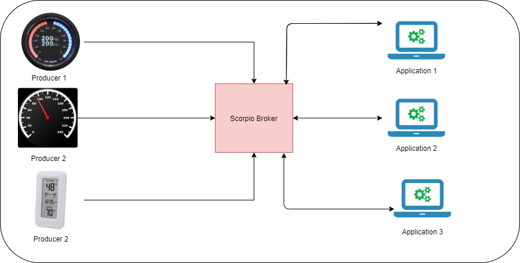

=====================
Scorpio Broker
=====================

The Scorpio Broker implements the NGSI-LD API through which context producers and consumers can interact with each other. For Example in the typical IoT based room, various sensors like temperature sensors, light sensors, etc are connected to the central application which uses those sensors output and acts as the consumer. There can be a lot of use cases for this central application i.e Scorpio. 

1. Scorpio uses the NGSI-LD API and information model to model entities with their properties and relationships, thus forming a property graph with the enitites as the nodes. It allows finding information by discovering entities, following relationships and filtering according to properties, relationships and related meta-information. For data not directly represented in NGSI-LD like video streams or 3D models, links can be added to the model that allows consumers to directly access this information. In this way, Scorpio can provide a graph-based index to a data lake.

2. Scorpio provides several interfaces for querying the stored data so easily analytics can be done on the stored data. like it can be used to predict the situation of an ecosystem. Example:- In a huge building there can be several fire sensors, temperature sensors, and smoke sensors. In case of a false fire alarm, it can be verified by the collected fire data, temperature data and smoke data of the particular area. 

3. Scorpio can be used for determining the accuracy of any event. For example, In an automated car, the speed of the car can be known by several applications like GPS, speed camera and speedometer. Scorpio's internal data is stored in this way that any third-party application can use it and can find the accuracy and determine faulty device.

.. toctree::
    :maxdepth: 1
    :caption: Introduction
    :numbered:

    introduction.rst

.. toctree::
    :maxdepth: 1
    :caption: Beginner Guide
    :numbered:

    onepageTutorial.rst
    buildScorpio.rst
    mqtt.rst

.. toctree::
    :maxdepth: 1
    :caption: FIWARE NGSI-LD API Walkthrough
    :numbered:

    API_walkthrough.rst
    
.. toctree::
    :maxdepth: 1
    :caption: Developer Guide
    :numbered:

    installationGuide.rst
    hardwareRequirement.rst
    errorHandling.rst
    security.rst
    HelloWorld.rst
    multivalue.rst

.. toctree::
    :maxdepth: 1
    :caption: Advanced User Guide
    :numbered:

    systemOverview.rst
    callFlow.rst
    contributionGuideline.rst
    docker.rst
    config.rst
    troubleshooting.rst
