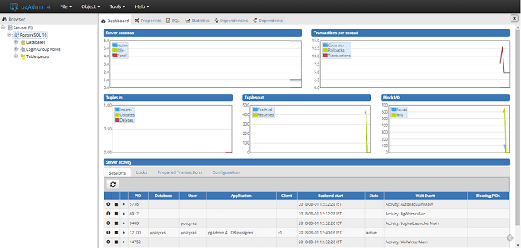

****************************
Developer Installation Guide
****************************

In order to set-up the environment of Scorpio broker, the following dependency needs to be configured:-

1. Eclipse.
2. Server JDK.
3. Apache Kafka.
4. PostgreSQL

Windows
#######

Eclipse installation
********************

- **Download the Eclipse Installer.**:

 Download Eclipse Installer from http://www.eclipse.org/downloads.Eclipse is hosted on many mirrors around the world. Please select the one closest to you and start to download the Installer.

- **Start the Eclipse Installer executable**:

 For Windows users, after the Eclipse Installer, the executable has finished downloading it should be available in your download directory. Start the Eclipse Installer executable. You may get a security warning to run this file. If the Eclipse Foundation is the Publisher, you are good to select Run.

 For Mac and Linux users, you will still need to unzip the download to create the Installer. Start the Installer once it is available.

- **Select the package to install**:

 The new Eclipse Installer shows the packages available to Eclipse users. You can search for the package you want to install or scroll through the list. Select and click on the package you want to install.

- **Select your installation folder**

 Specify the folder where you want Eclipse to be installed. The default folder will be in your User directory. Select the ‘Install’ button to begin the installation.

- **Launch Eclipse**

 Once the installation is complete you can now launch Eclipse. The Eclipse Installer has done its work. Happy coding.

JDK Setup
*********

- Start the JDK installation and hit the “Change destination folder” checkbox, then click 'Install.'

**Note:-** Recommended version is JDK-11. Scorpio Broker is developed and tested with this version only.

.. figure:: figures/jdk-1.png

- Change the installation directory to any path without spaces in the folder name.

After you've installed Java in Windows, you must set the  JAVA_HOME  environment variable to point to the Java installation directory.

**Set the JAVA_HOME Variable**

To set the JAVA_HOME variable:

1. Find out where Java is installed. If you didn't change the path during installation, it will be something like this:

 *C:\Program Files\Java\jdk1.version_detail*

2. - In Windows 8/10 go to **Control Panel** > **System** > **Advanced System Settings**.

  OR

 - In Windows 7 right-click **My Computer** and select **Properties** > **Advanced**.

3. Click the Environment Variables button.

4. Under System Variables, click New.

5. In the User Variable Name field, enter: **JAVA_HOME**

6. In the User Variable Value field, enter your JDK  path.

 (Java path and version may change according to the version of Kafka you are using)

7. Now click OK.

8. Search for a Path variable in the “System Variable” section in the “Environment Variables” dialogue box you just opened.

9. Edit the path and type *;%JAVA_HOME%\bin* at the end of the text already written there, just like the image below:

.. figure:: figures/jdk-3.png

- To confirm the Java installation, just open cmd and type “java –version.” You should be able to see the version of Java you just installed.

.. figure:: figures/jdk-4.png

If your command prompt somewhat looks like the image above, you are good to go. Otherwise, you need to recheck whether your setup version matches the correct OS architecture (x86, x64), or if the environment variables path is correct.

Setting Up Kafka
****************

1. Go to your Kafka config directory. For example:- **C:\kafka_2.11-0.9.0.0\config**
2. Edit the file “server.properties.”
3. Find and edit the line log.dirs=/tmp/kafka-logs” to “log.dir= C:\kafka_2.11-0.9.0.0\kafka-logs.
4. If your ZooKeeper is running on some other machine or cluster you can edit “zookeeper.connect:2181” to your custom IP and port. For this demo, we are using the same machine so there's no need to change. Also the Kafka port and broker.id are configurable in this file. Leave other settings as is.
5. Your Kafka will run on default port 9092 and connect to ZooKeeper’s default port, 2181.

**Note**: For running Kafka, zookeepers should run first. At the time of closing Kafka, zookeeper should be closed first than Kafka. Recommended version of kafka is kafka_2.12-2.1.0.

Running a Kafka Server
**********************

Important: Please ensure that your ZooKeeper instance is up and running before starting a Kafka server.

1. Go to your Kafka installation directory:** C:\kafka_2.11-0.9.0.0\**
2. Open a command prompt here by pressing Shift + right-click and choose the “Open command window here” option).
3. Now type **.\bin\windows\kafka-server-start.bat .\config\server.properties** and press Enter,then
4. Type **.\bin\windows\kafka-server-start.bat .\config\server.properties** in new command window and hit enter.

Setting up PostgreSQL
*********************

Step 1) Go to https://www.postgresql.org/download.

Step 2) You are given two options:-

 1. Interactive Installer by EnterpriseDB
 2. Graphical Installer by BigSQL

BigSQL currently installs pgAdmin version 3 which is deprecated. It's best to choose EnterpriseDB which installs the latest version 4

Step 3)

 1. You will be prompted to the desired Postgre version and operating system. Select the Postgres 10, as Scorpio has been tested and developed with this version.

 2. Click the Download Button, Download will begin

Step 4) Open the downloaded .exe and Click next on the install welcome screen.

Step 5) 

 1. Change the Installation directory if required, else leave it to default

 2.Click Next

Step 6)

 1. You can choose the components you want to install in your system. You may uncheck Stack Builder

 2. Click on Next

Step 7)

 1. You can change the data location

 2.Click Next

Step 8)

 1. Enter the superuser password. Make a note of it

 2.Click Next

Step 9)

 1. Leave the port number as the default

 2.Click Next

Step 10)

 1. Check the pre-installation summary.

 2.Click Next

Step 11) Click the next button

Step 12) Once install is complete you will see the Stack Builder prompt

 1. Uncheck that option. We will use Stack Builder in more advance tutorials

 2.Click Finish

Step 13) To launch Postgre go to Start Menu and search pgAdmin 4

Step 14) You will see pgAdmin homepage

Step 15) Click on Servers > Postgre SQL 10 in the left tree

.. figure:: figures/dbconfig-1.png

Step 16)

 1.Enter superuser password set during installation

 2. Click OK

Step 17) You will see the Dashboard

That's it to Postgre SQL installation.

Linux
#####
JDK Setup
*********
To create a Java environment in your machine install the JDK, for this open the terminal, and run the following commands:-

1. sudo apt-get update

2. sudo apt-get install openjdk-8-jdk

To check that JDK is properly installed in your machine, run the command **java -version** in your terminal if it returns the version of the JDK as 11 then it's working fine.

.. figure:: figures/javaTerminal

Eclipse installation
********************

To install the eclipse in your linux machine first, visit the link https://www.eclipse.org/downloads/ and select the version of eclipse based on the flavor of your linux machine.

Setting Up Kafka
****************

To download the Apache Kafka in your machine run the following commands one by one in your terminal.

1. mkdir kafka
2. cd kafka
3. wget https://archive.apache.org/dist/kafka/2.2.0/kafka_2.12-2.2.0.tgz
4. tar -xzf kafka_2.12-2.2.0.tgz

Once the Kafka is downloaded in your machine hit the following commands to get it run

1. kafka_2.12-2.2.0/bin/zookeeper-server-start.sh kafka_2.12-2.2.0/config/zookeeper.properties > /dev/null 2>&1 &
2. kafka_2.12-2.2.0/bin/kafka-server-start.sh kafka_2.12-2.2.0/config/server.properties > /dev/null 2>&1 &

Setting up PostgreSQL
*********************
In order to download the PostgreSQL in your machine run the following commands from your terminal.

1. sudo apt update
2. sudo apt-get install postgresql-10
3. service postgresql status

The last command will give us the status of the PostgreSQL four your machine if this matches to 
one in the picture then everything is properly installed else re-run the commands.
.. figure:: figures/postgresTerminal

Once PostgreSQL is successfully installed in your machine create the database **ngb** and change its role by running the following commands:

1.	psql -U postgres -c "create database ngb;"
2.	psql -U postgres -c "create user ngb with password 'ngb';"
3.	psql -U postgres -c "alter database ngb owner to ngb;"
4.	psql -U postgres -c "grant all privileges on database ngb to ngb;"
5.	psql -U postgres -c "alter role ngb superuser;"
6.	sudo apt install postgresql-10-postgis-2.4
7.	sudo apt install postgresql-10-postgis-scripts
8.	sudo -u postgres psql -U postgres -c "create extension postgis;

After this your PostgreSql is ready to use for Scorpio Boker.

