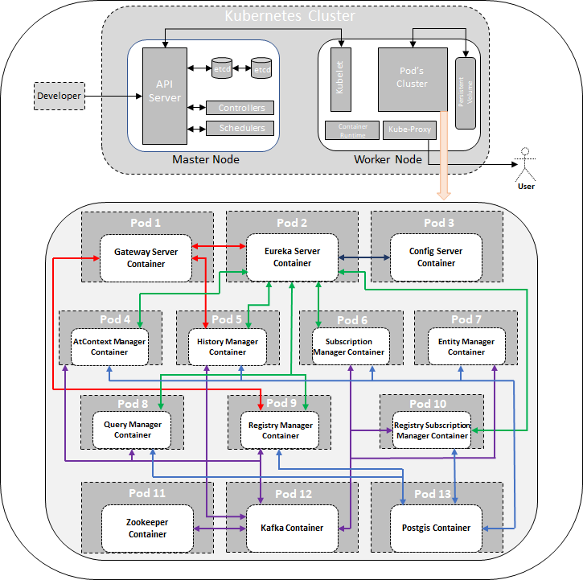

********************************
Scorpio Broker and Kubernetes
********************************

Kubernetes, or K8s, is a container orchestration system. In other words, when you use K8s, a container-based application can be deployed, scaled, and managed automatically.

The objective of using Kubernetes container orchestration for Scorpio Broker deployment is to abstract away the complexity of managing a fleet of containers that represent packaged applications and include the code and everything needed to them wherever they’re provisioned. By interacting with the K8s REST API, users can describe the desired state of their applications, and K8s does whatever is necessary to make the infrastructure conform. It deploys groups of containers, replicates them, redeploys if some of them fail, and so on.

Deployment Architecture
########################
Deployment architecture of scorpio Broker consist of master node and worker node configuration where master node is basically reponsible for the handling and managing all the kubernetes related task and worker node is where all the Scorpio Broker Micro-service get deployed.

All the micro-service in the cluster communicates from one another using the ClusterIp and this way we get the running cluster of Scorpio broker on Kubernetes 

Main features and benefits
###############################
The full feature set Kubernetes offers is much too large to cover, but we’ll discuss only those benefits and features which we achieved in Scorpio Broker Deployment.

**It’s portable and 100% open source:** Kubernetes can practically be deployed on any infrastructure so do the Scorpio Broker with Kubernetes. Run your containers in one or more public cloud environments, on your dedicated virtual machines, or on bare metal. You can use the same orchestration tool for all your different environments. Kubernetes’ compatibility across several platforms avoids infrastructure and cloud provider lock-in and makes a multi-cloud strategy and set up not only possible but highly usable and flexible as well. The project is 100% open-source, providing you with even more flexibility.

**Workload Scalability**: Through Kubernetes Scorpio Broker micro-services can be easily scaled up and down depending upon the needs:
 – **Horizontal Pod scaling:** Through this feature the number of instances of the serer can be easily increased or decreased depending upon the traffic .

 – **Auto-scaling:** With auto-scaling, user can automatically change the number of running instance of Scorpio Broker's micro-services, based on CPU utilization or other application-provided metrics.

 – **Manual scaling:** You can manually scale the number of running instance of Scorpio Broker's micro-services through a command or the interface and help reducing the pressure on the micro-service and improve the response time as well.

 – **Replication controller:** The Replication controller makes sure your cluster has a specified number of equivalent pods (a group of containers) running. If there are too many pods, the Replication Controller terminates the extra pods. If there are too few, it starts with more pods and help making sure that at all the time atleast one instance of each micro-service of Scorpio Broker is up and running.

**High Availability:** Kubernetes is designed to tackle the availability of both applications and infrastructure, making it indispensable when deploying containers in production:
 – **Health checks and self-healing:** Kubernetes guards each Scorpio Broker micro-services against failures by constantly checking the health of nodes and containers. 

 -**Self-healing and auto-replacement:** if any of the Scorpio broker's micro-service crashes due to an error, Kubernetes has got us covered and redeploy that micro-service.

 – **Traffic routing and load balancing:** traffics routing sends requests to the appropriate containers. Kubernetes also comes in with built-in load balancers to distribute your load across multiple pods, enabling you to (re)balance resources quickly in order to respond to outages, peak or incidental traffic, and batch processing. It’s also possible to use external load balancers.