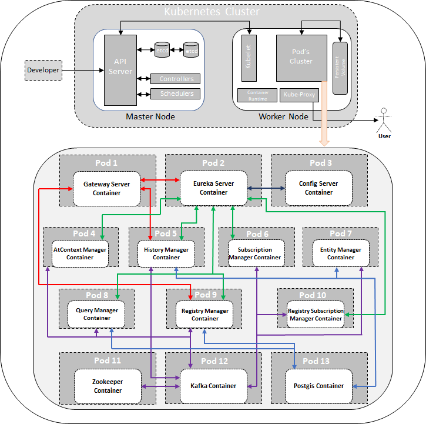

****************************
Introduction
****************************

Kubernetes, or K8s, is a container orchestration system. In other words, when you use K8s, a container-based application can be deployed, scaled, and managed automatically.

The objective of Kubernetes container orchestration is to abstract away the complexity of managing a fleet of containers that represent packaged applications and include the code and everything needed to them wherever they’re provisioned. By interacting with the K8s REST API, users can describe the desired state of their applications, and K8s does whatever is necessary to make the infrastructure conform. It deploys groups of containers, replicates them, redeploys if some of them fail, and so on.

Because it’s open-source, a K8s cluster can run almost anywhere, and the major public cloud providers all provide easy ways to consume this technology. Private clouds based on OpenStack can also run Kubernetes, and bare metal servers can be leveraged as worker nodes for it. So if you describe your application with K8s building blocks, you’ll then be able to deploy it within VMs or bare metal servers, on public or private clouds.

The K8s architecture is relatively simple. You never interact directly with the nodes hosting your application, but only with the control plane, which presents an API and is in charge of scheduling and replicating groups of containers named Pods. Kubectl is the command-line interface that allows you to interact with the API to share the desired application state or gather detailed information on the infrastructure’s current state.

Basic Components
#################
**Nodes**: Kubernetes runs your workload by placing containers into Pods to run on Nodes. A node may be a virtual or physical machine, depending on the cluster. Each node is managed by the control plane and contains the services necessary to run Pods

Typically you have several nodes in a cluster; in a learning or resource-limited environment, you might have just one.

The components on a node include the kubelet, a container runtime, and the kube-proxy.

**Master**: The control plane itself runs the API server (kube-apiserver), the scheduler (kube-scheduler), the controller manager (kube-controller-manager) and etcd, a highly available key-value store for shared configuration and service discovery implementing the Raft consensus Algorithm.

Terminology
#############

K8s has its own vocabulary which, once you get used to it, gives you some sense of how things are organized. These terms include:

**Pods:** Pods are a group of one or more containers, their shared storage, and options about how to run them. Each pod gets its own IP address.

**Labels:** Labels are key/value pairs that Kubernetes attaches to any objects, such as pods, Replication Controllers, Endpoints, and so on.

**Annotations:** Annotations are key/value pairs used to store arbitrary non-queryable metadata.
Services: Services are an abstraction, defining a logical set of Pods and a policy by which to access them over the network.

**Replication Controller:** Replication controllers ensure that a specific number of pod replicas are running at any one time.

**Secrets:** Secrets hold sensitive information such as passwords, TLS certificates, OAuth tokens, and ssh keys.

**ConfigMap:** ConfigMaps are mechanisms used to inject containers with configuration data while keeping containers agnostic of Kubernetes itself.

Main features and benefits
########################################
The full feature set Kubernetes offers is much too large to cover, but we’ll discuss the main benefits and features.

**It’s portable and 100% open source:** Kubernetes can practically be deployed on any infrastructure. Run your containers in one or more public cloud environments, on your dedicated virtual machines, or on bare metal. You can use the same orchestration tool for all your different environments. Kubernetes’ compatibility across several platforms avoids infrastructure and cloud provider lock-in and makes a multi-cloud strategy and set up not only possible but highly usable and flexible as well. The project is 100% open-source, providing you with even more flexibility.

**Workload Scalability**: Kubernetes is known to be efficient in its use of infrastructure resources and offers several useful features for scaling purposes:
 – **Horizontal infrastructure scaling:** Kubernetes operates at the individual server level to implement horizontal scaling. New servers can be added or removed easily.

 – **Auto-scaling:** With auto-scaling, you can automatically change the number of running containers, based on CPU utilization or other application-provided metrics.

 – **Manual scaling:** You can manually scale the number of running containers through a command or the interface.

 – **Replication controller:** The Replication controller makes sure your cluster has a specified number of equivalent pods (a group of containers) running. If there are too many pods, the Replication Controller terminates the extra pods. If there are too few, it starts with more pods.

**High Availability:** Kubernetes is designed to tackle the availability of both applications and infrastructure, making it indispensable when deploying containers in production:

 – **Health checks and self-healing:** Kubernetes guards your containerized application against failures by constantly checking the health of nodes and containers. Kubernetes also offers self-healing and auto-replacement: if a container or pod crashes due to an error, Kubernetes has got you covered.

 – **Traffic routing and load balancing:** traffics routing sends requests to the appropriate containers. Kubernetes also comes in with built-in load balancers to distribute your load across multiple pods, enabling you to (re)balance resources quickly in order to respond to outages, peak or incidental traffic, and batch processing. It’s also possible to use external load balancers.