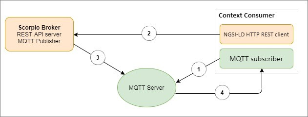

******************
MQTT Notifications
******************

MQTT is a pub/sub based message bus and works with topics. For more detailed information please visit https://mqtt.org/.
NGSI-LD allows you to receive notifications via MQTT. 
A subscription received via HTTP specifies an MQTT endpoint in the "notification.endpoint.uri" member of the subscription and the MQTT notification binding is supported by the NGSI-LD implementation, notifications related to this subscription shall be sent via the MQTT protocol.

The syntax of an MQTT endpoint URI is **mqtt[s]://[<username>][:<password>]@<host>[:<port>]/<topic>[/<subtopic>]*** and follows an existing convention for representing an MQTT endpoint as a URI.

Username and password can be optionally specified as part of the endpoint URI. If the port is not explicitly specified, the default MQTT port is **1883** for MQTT over TCP and **8883** for MQTTS,
For the MQTT protocol, there are currently two versions supported, **MQTTv3.1.1** and **MQTTv5.0**.

The flow of Scorpio broker notification via MQTT:-

1. Subscribe to TOPIC.
2. Create NGSI-LD Subscription, with MQTT Server's URI as a contact point to send Notifications.
3. Publish Notifications to TOPIC extracted from URI.
4. Send Notifications from the MQTT server to the MQTT subscriber.

To start the MQTT broker follow the below step:-

1. Install the MQTT broker (Mosquitto).
2. Add chrome extension MQTTlens.
3. Create the MQTT broker connection.
4. Subscribe the topic.

Operations
############

1. Entity Creation
*********************

To create the entity, hit the endpoint **http://<IP Address>:<port>/ngsi-ld/v1/entities/** with the given payload.

.. code-block:: JSON

 {
 "id":"urn:ngsi-ld:Vehicle:A135",
 "type":"Vehicle",
 "brandName":{
   "type":"Property",
   "value":"Mercedes"
 },
 "speed":[{
   "type":"Property",
   "value": 55,
   "datasetId": "urn:ngsi-ld:Property:speedometerA4567-speed",
   "source":{
     "type":"Property",
     "value": "Speedometer"
   }
 },
  {
   "type":"Property",
   "value": 11,
    "datasetId": "urn:ngsi-ld:Property:gpsA4567-speed",
   "source":{
     "type":"Property",
     "value": "GPS"
   }
   },
   {
   "type":"Property",
   "value": 10,
   "source":{
     "type":"Property",
     "value": "CAMERA"
   }
 }]
 }

2. Subscription
*********************

To subscribe to the entity, hit the endpoint **http://<IP Address>:<port>/ ngsi-ld/v1/subscriptions/** with the given payload.

.. code-block:: JSON

 {
   "id": "urn:ngsi-ld:Subscription:16",
   "type": "Subscription",
   "entities": [{
          "id": "urn:ngsi-ld:Vehicle:A135",
          "type": "Vehicle"
        }],
  "watchedAttributes": ["brandName"],
        "q":"brandName!=Mercedes",
  "notification": {
   "attributes": ["brandName"],
   "format": "keyValues",
   "endpoint": {
    "uri": "mqtt://localhost:1883/notify",
    "accept": "application/json",
    "notifierinfo": {
      "version" : "mqtt5.0",
      "qos" : 0
     }
   }
  }
 }

3. Notification
*********************

If we update the value of the attribute and making the PATCH request at  **http://<IP Address>:<port>/ngsi-ld/v1/entities/entityId/attrs**

.. code-block:: JSON

 {
   "brandName":{
       "type":"Property",
       "value":"BMW"
  }
 }

then, we get the notification.

.. code-block:: JSON

 {
  "metadata": {
  "link": "https://json-ld.org/contexts/person.jsonld",
  "contentType": "application/json"
 },
 "body": {
  "id": "ngsildbroker:notification:-7550927064189664633",
  "type": "Notification",
  "data": [{
   "id": "urn:ngsi-ld:Vehicle:A135",
   "type": "Vehicle",
   "brandName": {
    "type": "Property",
    "createdAt": "2020-07-29T07:19:33.872000Z",
    "value": "BMW",
    "modifiedAt": "2020-07-29T07:51:21.183000Z"
   }
  }],
  "notifiedAt": "2020-07-29T07:51:22.300000Z",
  "subscriptionId": "urn:ngsi-ld:Subscription:16"
  }
 }    
