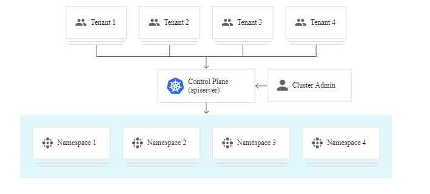

********************************
Multi-Tenancy through Kubernetes
********************************
A multi-tenant cluster is shared by multiple users and/or workloads which are referred to as "tenants". The operators of multi-tenant clusters must isolate tenants from each other to minimize the damage that a compromised or malicious tenant can do to the cluster and other tenants. Also, cluster resources must be fairly allocated among tenants.

When you plan a multi-tenant architecture you should consider the layers of resource isolation in Kubernetes: cluster, namespace, node, Pod, and container. You should also consider the security implications of sharing different types of resources among tenants. For example, scheduling Pods from different tenants on the same node could reduce the number of machines needed in the cluster.
In order to ensure complete isolation between different tenets following policy should be enforced in the Kubernetes cluster.

Namespace based Multi-Tenancy
################################
Isolation for the different tenet can be achieved using namespace-based segregation, for this, every tenet is provided with its own namespace, and complete isolation is ensured between different tenets using network and RBAC policies.

RBAC policies
################
To provide access to the different users in their allowed namespaces RBAC policies are used.
Using RBAC policies various roles can be defined and authorization can be controlled.

To apply RBAC policies you can use the following code snippet and tweak it as per the desired conditions.

.. code-block:: yaml

 kind: Role
 apiVersion: rbac.authorization.k8s.io/v1
 metadata:
 #  namespace: test
   name: testing-services-admin-role
 rules:
   - apiGroups: ["*"]
     resources: ["*"]
     verbs:
       - create
       - get
       - describe
       - delete
       - list
       - update
       - edit
       - watch
       - exec
       - patch
 ---
 apiVersion: rbac.authorization.k8s.io/v1
 kind: RoleBinding
 metadata:
 #  namespace: test
   name: testing-services-admin
 subjects:
   - kind: Group
     name: testing-services-admin-group
     apiGroup: rbac.authorization.k8s.io
 roleRef:
   kind: Role
   name: testing-services-admin-role
   apiGroup: rbac.authorization.k8s.io 

Network policies
####################
Cluster network policies give you control over the communication between your cluster's Pods. Policies specify which namespaces, labels, and IP address ranges a Pod can communicate with.

In order to apply the network policy in your cluster, you can use the following snippet and tweak it in accordance with the need. 

.. code-block:: yaml

 kind: NetworkPolicy
 apiVersion: networking.k8s.io/v1
 metadata:
   name: block-external-namepsace-traffic
 #  namespace: test
 spec:
   podSelector:
     matchLabels:
   ingress:
   - from:
     - podSelector: {}

Resource quotas
####################
Resource quotas manage the amount of resources used by the objects in a namespace. You can set quotas in terms of CPU and memory usage, or in terms of object counts. Resource quotas let you ensure that no tenant uses more than its assigned share of cluster resources.

Use this file to ensure the resource quotas to the desired namespace, quota can we fixed based upon the needs.

.. code-block:: yaml

 apiVersion: v1
 kind: ResourceQuota
 metadata:
   name: mem-cpu-demo
 #  namespace: test
 spec:
   hard:
     requests.cpu: "1"
     limits.cpu: "2" 