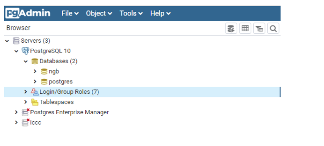

*************************
Multi-Tenant Support
*************************
Multi-tenant refers to a kind of architecture where a single instance of software runs on a server and serves multiple customers. In a multi-tenant environment, separate customers tap into the same hardware and data storage, creating a dedicated instance for each customer.

In above diagram we called Rest API with tenant .The data goes into the respective tenant DB. We are going to create a database in POSTGRESQL for each tenant so for Tenant 1 it would be DB tenant_1_db and for Tenant 2 it would be tenant_2_db.
We will connect to the respective database during runtime based on the tenant provided through http headers.

Example
-------

.. code-block:: JSON
 
 curl -X POST \
  http://localhost:9090/ngsi-ld/v1/entities/ \
  -H 'Accept: application/ld+json' \
  -H 'Content-Type: application/json' \
  -H 'NGSILD-Tenant: urn:ngsi-ld:Example:tenant1' \
  -d '{
	"id": "urn:ngsi-ld:Vehicle:",
	"type": "Vehicle",
	"brandName": {
		"type": "Property",
		"value": "Test"
	},
	"isParked": {
		"type": "Relationship",
		"object": "urn:ngsi-ld:OffStreetParking:Downtown1",
		"observedAt": "2017-07-29T12:00:04Z",
		"providedBy": {
			"type": "Relationship",
			"object": "urn:ngsi-ld:Person:Bob"
		}
	},
	"speed": {
		"type": "Property",
		"value": 80
	},
	"createdAt": "2017-07-29T12:00:04Z",
	"modifiedAt": "2017-07-29T12:00:04Z",
	"location": {
		"type": "GeoProperty",
		"value": {
			"type": "Point",
			"coordinates": [-8.5, 41.2]
		}
	}
 }' 

