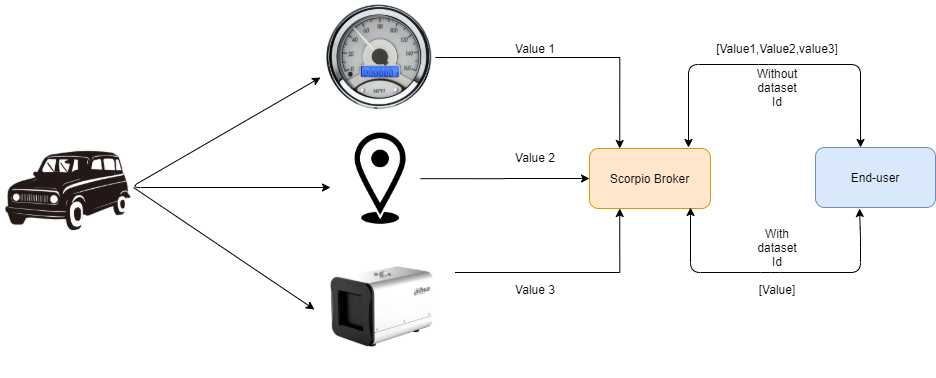

*************************
Multi-value Attribute
*************************

Multi-value Attribute is a feature through which an Entity can simultaneously have Attributes with more than one instance.
In the case of Properties, there may be more than one source at a time that provides a Property instance, e.g. based on independent sensor measurements with different quality characteristics.

For example: take a speedometer and a GPS both providing the current speed of a car or take a thermometer or an infrared camera both provides the temperature of the body.

In the case of Relationships, there may be non-functional Relationships, e.g. for a room, there may be multiple "contains" Relationships to all sorts of objects currently in the room that have been put there by different people and which are dynamically changing over time.
To be able to explicitly manage such multi-attributes, the optional datasetId property is used, which is of datatype URI.

CRUD Operations
-----------------------------

If a datasetId is provided when creating, updating, appending or deleting Attributes, only instances with the same datasetId are affected, leaving instances with another datasetId or an instance without a datasetId untouched.
If no datasetId is provided, it is considered as the default Attribute instance. It is not required to explicitly provide this default datasetId, but even if not present it is treated as if this default datasetId was present in the request(s).
Thus the creation, updating, appending or deleting of Attributes without providing a datasetId only affects the default property instance.

Note:-There can only be one default Attribute instance for an Attribute with a given Attribute Name in any request or response.

When requesting Entity information, if there are multiple instances of matching Attributes these are returned as arrays of Attributes respectively, instead of a single Attribute element. The datasetId of the default Attribute instance is never explicitly included in responses.
In case of conflicting information for an Attribute, where a datasetId is duplicated, but there are differences in the other attribute data, the one with the most recent observedAt DateTime, if present, and otherwise the one with the most recent modifiedAt DateTime shall be provided.

Create Operation
------------------
In order to create the entity with the multi-value attribute, we can hit the endpoint **http://<IP Address>:<port>/ngsi-ld/v1/entities/**  with the given payload.

.. code-block:: JSON

 {
  "id":"urn:ngsi-ld:Vehicle:A101",
  "type":"Vehicle",
  "brandName":{
    "type":"Property",
    "value":"Mercedes"
  },
  "speed":[{
    "type":"Property",
    "value": 55,
    "datasetId": "urn:ngsi-ld:Property:speedometerA4567-speed", //dataset id is defined
    "source":{
      "type":"Property",
      "value": "Speedometer"
    }
  },
  {
    "type":"Property",
    "value": 60,
    "source":{
      "type":"Property",
      "value": "GPS"
    }
  },
  {
    "type":"Property",
    "value": 52.5,
    "datasetId": "urn:ngsi-ld:Property1111-speed",
    "source":{
      "type":"Property",
      "value": "GPS_NEW"
    }
  }],
  "createdAt":"2017-07-29T12:00:04Z",
  "modifiedAt" : "2017-07-29T12:00:04Z",
  "location":{
    "type":"GeoProperty",
    "value":"{ \"type\":\"Point\", \"coordinates\":[ -8.5, 41.2 ] }"
  }    
 }

Update Operation
------------------
- **Update the attribute instance value based on datasetId**

 We can update the value of the particular instance by sending the datasetId in the body and making the PATCH request at **http://<IP Address>:<port>/ngsi-ld/v1/entities/entityId/attrs/attrsId**

.. code-block:: JSON

 {
   "value":"20",
   "datasetId": "urn:ngsi-ld:Property:speedometerA4567-speed"
 }  

- **Update the default attribute instance value based on attribute name**

 We can update the value of the default instance by making the PATCH request at **http://<IP Address>:<port>/ngsi-ld/v1/entities/entityId/attrs/attrsId** with only updated value in the payload.

.. code-block:: JSON

 {
   "value":"21"
 }

Delete Operation
--------------------

- **Delete the default attribute instance**

 In order to delete the default attribute instance, make the DELETE request with URL **http://<IP Address>:<port>/ngsi-ld/v1/entities/entityId/attrs/attrsId** this will delete the default instance of the attribute.

- **Delete the attribute instance with  datasetId**

 To delete the particular attribute instance, make a DELETE request with URL **http://<IP Address>:<port>/ngsi-ld/v1/entities/entityId/attrs/attrsId?datasetId={{datasetId}}** where datasetId is the id of the instance which we require to be deleted. 

- **Delete all the attribute instance with the given attribute name**

 If we want to delete all the attribute instance with the given attribute name, then we need to make DELETE request with the URL **http://<IP Address>:<port>/ngsi-ld/v1/entities/entityId/attrs/attrsId?deleteAll=true** 
