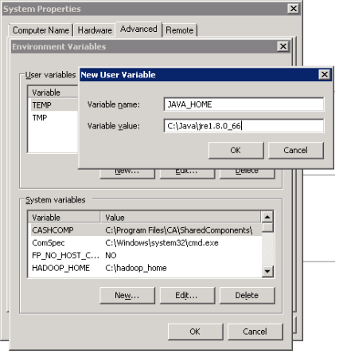
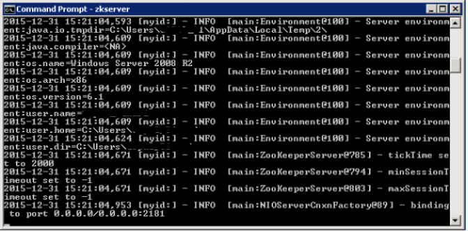

*****************************************
Beginners Guide
*****************************************
This Section will give you the high level over view of the basic architecture of the scorpio broker with the brief description of every component of the scorpio broker. This section also covers the step by step guide to set up the scorpio broker environment.

*****************************************
Architecture Overview
*****************************************

The deployment architecture leverages the Spring Cloud framework that address lots of Micro-services concerns(e.g. scaling, monitoring, fault tolerant, highly available, secure, decoupled etc. ) and kafka based distributed and scalable message queue infrastructure to provide high performance on message processing for huge number of context requests which is usual in the IoT domain.

It covers the high level operations (Http based REST with method POST/GET/DELETE/PATCH) request flow from external world to NGB system.  The external request is served through a unified service API gateway interface that exposes a single ip/port combination to be used for all services that NGB system can provides. In reality each of the NGB service will be implemented as a micro-service that can be deployed as an independent standalone unit in distributed computing environment. That API gateway routes all the incoming requests to the specific Micro-services with the help of registration & discovery service. Once the request reaches at micro-service based on the operation requirement it uses(pub/sub) kafka topics (message queues) for real time storage and for providing intercommunication among different micro-services (based on requirement) over message queues.

.. figure:: figures/architecture.png

- **Application**: End user/domain applications leverage IoT Broker to provide the required information about IoT infrastructure. This applications can query, subscribe, update context information to/from the IoT Broker as per their requirements.
- **IoT Entities**: These are the physical IoT devices installed to perform specific functions. In order to send their information about their function, they needs to access IoT Broker either directly or via some IoT gateway or NGSI-LD adapter.
- **Consumers**: These are the IoT entities or applications that consumes the data of context source.
- **Producers**: These are the IoT entities, context source or applications that produces the context data to the IoT Broker.
- **Service API Gateway**: This is the proxy gateway for the external world to access the internal services of NGB system exposed via REST based HTTP interfaces. All internal NGB related services can be accessed through this service gateway using its single IP & port (which are usually static) and extending the service name in the URL. Thus user does not need to take care of (or learn or use) the IP and Port  of every service which often changes dynamically. This makes the life more easy, especially in a case when multiple services (or micro-service) are running under one system. This is easily solved by the use of proxy gateway(i.e. service API gateway) for all the back-end services.
- **Rest Interface**: These are the HTTP based interface for the external entities/applications to consume in order to do certain operation on IoT Broker. The external interface would be visible through Service API gateway and internal interface mapping to each requested service would be discovered through service registration & discovery module.
- **Service Discovery & Registration**: This component allows registration of any service (web service/micro-service) with it so that any client using discovery functionality of this component can determine the location of a service instance to which it wants to send requests. So in short, a service registry & discovery implements a database of services, their instances and their locations. Service instances gets registered with the service registry on startup and deregistered on shutdown. Client of the service, query the service registry, which discovers the available instances of a service. A service registry might also invoke a service instance’s health check API to verify that it is able to handle requests.
- **Entity Manager**: This component will handle all entity related CRUD operations with the help of other components of NGB.
- **LD Context Resolver**: This component is responsible for resolving NGSI_LD context in to json structured message in order to be further processed by other components on NGB.
- **Subscription & Notification Manager**: This component is responsible for handling CRUD operations related to entities and/or csource subscription & notification.
- **Query Manager**: This component will handle simple or complex query (Geo query based on NGSI-LD context) operations of NGB system. 
- **Storage Manager**: This component will be responsible for fetching data from message brokers and then transforming them in to relevant schema format in order to persist in DB tables. Additionally this manager will also provide interfaces for complex queries to DB e.g. Geo query or cross domain entity context relationship queries.
- **Context Registry Manager**: This component will be responsible for providing interfaces for CRUD operations of csource registration/query/ subscription.
- **Health Check & Monitoring**: This component will be responsible to monitor the health of running services & infrastructure.
- **Message Bus Handler**: Every module of NGB may needs to communicate with the bus for the inter-module exchange of messages. This interface is provided by the message bus  handler.
- **Storage Connectors**: The NGB needs to store certain information in different DB formats. So storage connectors (using any type of message broker methodology) provide the way to connect to those storage (which may be present locally or remotely). For e.g. the the entity information could be stored/streamed into different type of storage e.g. MySQL, PostgreSQL, Bigdata etc. These connectors could also be implemented for storage resiliency purposes.
- **Context Registry Connector**: IoT Broker needs to communicate to context registry in order to know about the registered context sources (brokers/providers) and the type of data model they support. The context registry connector will allow the message broker mechanism to connect the context registry that may be running locally  or remotely in federated mode.
- **Storage**: This is the actual storage (e.g. Postgres/Postgis) where in the data would be persisted. 
- **Context Registry**: This is the component which will be responsible for saving the registration of the context sources/producers. 

*****************************************
Installation Guide
*****************************************

In order to set-up the environment of scorpio broker,the following dependency need to be configured:-

1. Eclipse.
2. Server JRE.
3. 7-zip.
4. ZooKeeper.
5. Apache Kafka.

*****************************************
Eclipse installation
*****************************************

- **Download the Eclipse Installer.**:

 Download Eclipse Installer from http://www.eclipse.org/downloads.Eclipse is hosted on many mirrors around the world. Please select the one closest to you and start to download the Installer.

- **Start the Eclipse Installer executable**:

 For Windows users, after the Eclipse Installer executable has finished downloading it should be available in your download directory. Start the Eclipse Installer executable. You may get a security warning to run this file. If the Eclipse Foundation is the Publisher, you are good to select Run.

 For Mac and Linux users, you will still need to unzip the download to create the Installer. Start the Installer once it is available.

- **Select the package to install**:

 The new Eclipse Installer shows the packages available to Eclipse users. You can search for the package you want to install or scroll through the list.Select and click on the package you want to install.

- **Select your installation folder**

 Specify the folder where you want Eclipse to be installed. The default folder will be in your User directory.Select the ‘Install’ button to begin the installation.

- **Launch Eclipse**

 Once the installation is complete you can now launch Eclipse. The Eclipse Installer has done it's work. Happy coding.

*****************************************
JDK Setup
*****************************************

- Start the JRE installation and hit the “Change destination folder” checkbox, then click 'Install.'

.. figure:: figures/jre-1.png

- Change the installation directory to any path without spaces in the folder name. E.g. C:\Java\jre1.8.0_xx\. (By default it will be C:\Program Files\Java\jre1.8.0_xx), then click 'Next.'

- Now open the system environment variables dialogue by opening Control Panel -> System -> Advanced system settings -> Environment Variables.

- Hit the New User Variable button in the User variables section, then type JAVA_HOME in Variable name and give your jre path in the Variable value. It should look like the below image:

 (Java path and version may change according to the version of Kafka you are using)

- Now click OK.

- Search for a Path variable in the “System Variable” section in the “Environment Variables” dialogue box you just opened.

- Edit the path and type “;%JAVA_HOME%\bin” at the end of the text already written there, just like the image below:

.. figure:: figures/jre-3.png

- To confirm the Java installation, just open cmd and type “java –version.” You should be able to see the version of Java you just installed.

.. figure:: figures/jre-4.png

If your command prompt somewhat looks like the image above, you are good to go. Otherwise, you need to recheck whether your setup version matches the correct OS architecture (x86, x64), or if the environment variables path is correct.

*****************************************
ZooKeeper Installation
*****************************************

1. Go to your ZooKeeper config directory. For me its C:\zookeeper-3.4.7\conf
2. Rename file “zoo_sample.cfg” to “zoo.cfg”
3. Open zoo.cfg in any text editor, like Notepad; I prefer Notepad++.
4. Find and edit dataDir=/tmp/zookeeper to :\zookeeper-3.4.7\data  
5. Add an entry in the System Environment Variables as we did for Java.

 a. Add ZOOKEEPER_HOME = C:\zookeeper-3.4.7 to the System Variables.
 b. Edit the System Variable named “Path” and add ;%ZOOKEEPER_HOME%\bin; 

6. You can change the default Zookeeper port in zoo.cfg file (Default port 2181).
7. Run ZooKeeper by opening a new cmd and type zkserver.
8. You will see the command prompt with some details, like the image below:

*****************************************
Setting Up Kafka
*****************************************

1. Go to your Kafka config directory. For me its **C:\kafka_2.11-0.9.0.0\config**
2. Edit the file “server.properties.”
3. Find and edit the line log.dirs=/tmp/kafka-logs” to “log.dir= C:\kafka_2.11-0.9.0.0\kafka-logs.
4. If your ZooKeeper is running on some other machine or cluster you can edit “zookeeper.connect:2181” to your custom IP and port. For this demo, we are using the same machine so there's no need to change. Also the Kafka port and broker.id are configurable in this file. Leave other settings as is.
5. Your Kafka will run on default port 9092 and connect to ZooKeeper’s default port, 2181.

*****************************************
Running a Kafka Server
*****************************************

Important: Please ensure that your ZooKeeper instance is up and running before starting a Kafka server.

1. Go to your Kafka installation directory:** C:\kafka_2.11-0.9.0.0\**
2. Open a command prompt here by pressing Shift + right click and choose the “Open command window here” option).
3. Now type **.\bin\windows\kafka-server-start.bat .\config\server.properties** and press Enter.

 **.\bin\windows\kafka-server-start.bat .\config\server.properties**

*****************************************
Setting up PostgreSQL
*****************************************

Step 1) Go to https://www.postgresql.org/download and select O.S. ,it's Windows for me.

Step 2) You are given two options:-

 1. Interactive Installer by EnterpriseDB
 2. Graphical Installer by BigSQL

BigSQL currently installs pgAdmin version 3 which is deprecated. It's best to choose EnterpriseDB which installs the latest version 4

Step 3)

 1.You will be prompted to desired Postgre version and operating system. Select the latest 
 Postgre version and OS as per your environment

 2.Click the Download Button

Download will begin

Step 4) Open the downloaded exe and Click next on the install welcome screen.

Step 5) 

 1.Change the Installation directory if required, else leave it to default

 2.Click Next

Step 6)

 1.You may choose the components you want to install in your system. You may uncheck Stack Builder

 2.Click Next

Step 7)

 1.You may change the data location

 2.Click Next

Step 8)

 1.Enter super user password. Make a note of it

 2.Click Next

Step 9)

 1.Leave the port number as default

 2.Click Next

Step 10)

 1.Check the pre-installation summary:
 2.Click Next

Step 11) Click the next button

Step 12) Once install is complete you will see the Stack Builder prompt

 1.Uncheck that option. We will use Stack Builder in more advance tutorials

 2.Click Finish

Step 13) To launch Postgre go to Start Menu and search pgAdmin 4

Step 14) You will see pgAdmin homepage

Step 15) Click on Servers > Postgre SQL 10 in the left tree

Step 16)

 1.Enter super user password set during installation

 2.Click OK

Step 17) You will see the Dashboard

That's it to Postgre SQL installation.

*****************************************
configure postgresql for the first time
*****************************************
 
C:\Program Files (x86)\PostgreSQL\10\data

1.Edit the pg_hba.conf file :

sudo vim /etc/postgresql/9.1/main/pg_hba.conf
And change "peer" to "md5" on the line concerning postgres :
local      all     postgres     peer md5

2.Restart the database :

Then create a database "ngb":

postgres=# create database ngb;

Create a user "ngb" and make him a superuser:

postgres=# create user ngb with encrypted password 'ngb';

postgres=# alter user ngb with superuser;

Grant privileges on database:

postgres=# grant all privileges on database ngb to ngb;

Also create an own database/schema for the Postgis extension:

postgres=# CREATE DATABASE gisdb;

postgres=# \connect gisdb;

postgres=# CREATE SCHEMA postgis;

postgres=# ALTER DATABASE gisdb SET search_path=public, postgis, contrib;

postgres=# \connect gisdb;

postgres=# CREATE EXTENSION postgis SCHEMA postgis;

Now First Run eureka in SpringCloudModule 
By java Application 
 
2.
Open Browser and open url--http://localhost:8761/

Now Run config-server in SpringCloudModules

Check on Eureka Server config-server is up or not

Now Run gatway in SpringCloudModules

Check on Eureka Server gatway is up or not

Now Run all manager in core module (entitymanager, subscriptionmanager…….)

Check on Eureka Server entity manager is up or not
