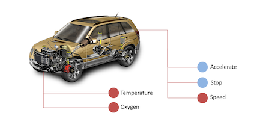
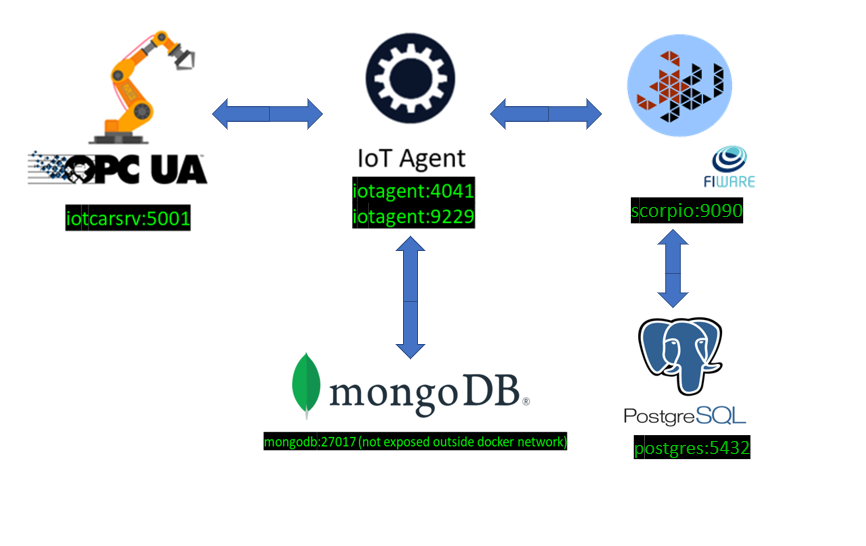

Integrate Scorpio Broker with OPC UA IoT agent 
****************************************************

This is a step-by-step tutorial to enable an OPC UA IoT Agent with Scorpio Context Broker. The OPC UA data will be automatically published in a FIWARE Context Broker using NGSI-LD data model.

**What is OPC UA?**

OPC UA is a well-known client-server protocol used in the Industry.

In real environments, an OPC UA server is usually responsible for fetching sensor data from factory-level machinery making them available to an OPC UA client (OPC-UA IoT Agent in our case).

Before a client can retrieve their values, sensors are mapped to the OPC UA Server Address Space as variables (or attributes). Moreover, it is also possible to control the machinery invoking methods exposed by the server.

Sensor values access is provided through a subscription mechanism. For each sensor value the OPC UA client wants to have access to, it creates a subscription specifying some parameters. Using these parameters the client asks the server to send data according to some particular modalities. At that point the server determines if the requests can be fulfilled, otherwise it will continue sending data in a best effort mode.

In our case the OPC UA IoT Agent acts as bridge between the OPC UA server and the Scorpio Broker behaving as an OPC UA client.

Actors
****************************************************

The actors involved in the scenario are:

-   **OPC UA Server**, representing the data source
-   **OPC UA IoT Agent**, the connector to join industrial environment to FIWARE
-   **Scorpio Broker**, the broker as entry point of FIWARE platform

**OPC UA Server**

For tutorial purposes, you will use a simple OPC UA server (source code : https://github.com/Engineering-Research-and-Development/opc-ua-car-server).

It represents a car with the following structure:

-   Car (obj)

    -   Speed (attr)

    -   Accelerate (meth)

-   Stop (meth)

    -   Engine (obj)

        -   Temperature (attr)
        -   Oxygen (attr)

-   Sensors

    -   Any number of user-defined Boolean sensor simulating a square-wave

        For each sensor it is possible to define the semi-period
		
**OPC UA IoT Agent**

The IoT Agent container relies on the presence of the Scorpio Context Broker and uses a MongoDB database to hold device information such as device URLs and Keys. The container is listening on two ports:

-   Port 9229 is exposed to receive OPC UA measurements over HTTP from the OPC UA server.
-   Port 4041 is exposed purely for tutorial access - so that cUrl or Postman can make provisioning commands without being part of the same network.

**Scorpio Broker**

Scorpio Broker can be external, however to have a black box for testing, it will be included in docker compose in order to have a self-supporting environment. Scorpio-Broker is an NGSI-LD compliant broker so we will be testing OPC UA IoT Agent for NGSI-LD tests. 

Start Up
****************************************************

Please clone the repository and create the necessary images like scorpio broker and IoT agent by running the commands as shown:

.. code-block:: console
    
     git clone https://github.com/ScorpioBroker/ScorpioBroker.git
	 git checkout iotagent-opcua
     cd ScorpioBroker/iotagent-opcua/docker

    docker-compose up -d
  
     If you want to clean up and start over again you can do this with the following command:
    
    docker-compose down -v
  
**Note:** version of docker-compose should be greater than 1.21.*.

After that you can run:

.. code-block:: console

	docker ps

to check if all the required components are running

Before you start the following steps, please check if your Scorpio broker is running properly.

check if the Scorpio broker is running

.. code-block:: console

	curl <scorpio-brokerIP>:9090/actuator/health

check if the IoT Agent is running

.. code-block:: console

	curl <IoT-AgentIP>:4041/iot/about

The response will look similar to the following:

.. code-block:: console

	{
		"libVersion": "2.24.0-next",
		"port": "4041",
		"baseRoot": "/",
		"version": "2.0.4"
	}
    
Running the docker environment (using configuration files) creates the following situation:
	

Step By Step Tutorial for North Bound and South Bound Communication
====================================================================

In this tutorial we are going to describe how to quickly deploy a working testbed consisting of all the actors: Car Server, OPC UA IoT Agent, Scorpio Broker, MongoDB instance and Postgres instance. So that we can understand the flow of how to fetch data from IoT Agent to Scorpio Broker.

**Step 1:** Start using the testbed
-----------------------------------------------------------------

For the Agent to work an *initialization* phase is required. During this phase the Agent becomes aware of what variables and methods are available on OPC UA server-side. These information can be provided to the agent by means of a configuration file (config.json) or through the REST API

Three different initialization modalities are available:

-   Use a preloaded config.js
-   Invoke a mapping tool responsible of automatically building the config.js (**NOTE:** **_Before using the MappingTool, erase the three objects: *types*, *contexts*, *contextSubscriptions* within the existing config.js_**)
-   Use the REST API

**Note:** Since in the following parts of this tutorial we are going to use the REST API. The default empty config.json is preloaded and we have disabled autoprovisioning for this tutorial so we will be provisioning device using REST API. 

**Step 2:** Provision a new Device
----------------------------------
By Device we mean the set of variables (attributes) and methods available on OPC UA Server-side.

To provision the Device corresponding to what the CarServer offers, use the following REST call:

.. code-block:: console  

	curl --location --request POST 'http://<IoT-AgentIP>:4041/iot/devices' \
	--header 'fiware-service: opcua_car' \
	--header 'fiware-servicepath: /demo' \
	--header 'Content-Type: application/json' \
	--data-raw '{
		"devices": [
			{
				"device_id": "age01_Car",
				"entity_name": "urn:ngsi-ld:Device:age01_Car",
				"entity_type": "Device",
				"apikey": "iot",
				"service": "opcua_car",
				"subservice": "/demo",
				"endpoint": "opc.tcp://host.docker.internal:5001/UA/CarServer",
				"attributes": [
					{
						"name": "EngineBrake",
						"type": "Number"
					},
					{
						"name": "Acceleration",
						"type": "Number"
					},
					{
						"name": "EngineStopped",
						"type": "Boolean"
					},
					{
						"name": "Engine_Temperature",
						"type": "Number"
					},
					{
						"name": "Engine_Oxigen",
						"type": "Number"
					}
				],
				"lazy": [
					{
						"name": "Speed",
						"type": "Number"
					}
				],
				"commands": [
					{
						"name": "CarError",
						"type": "command"
					},
					{
						"name": "CarStop",
						"type": "command"
					},
					{
						"name": "CarAccelerate",
						"type": "command"
					}
				]
			}
		]
	}'

**Step 3:** IoT Agent records the measurement of Actuator after Provisioning the Device on it and forward the measurement to Scorpio. Execute the following command to retrieve the recorded measurement of actuator from Scorpio

.. code-block:: console 

	curl --location --request GET 'http://<scorpio-brokerIP>:9090/ngsi-ld/v1/entities/urn:ngsi-ld:Device:age01_Car' \
	--header 'NGSILD-Tenant: opcua_car' \
	--header 'NGSILD-Path: /demo' \
	--header 'Content-Type: application/json'

Response
-------------------

.. code-block:: console 

	{
		"id": "urn:ngsi-ld:Device:age01_Car",
		"type": "Device",
		"CarAccelerate_info": {
			"type": "Property",
			"value": {
				"type": "commandResult",
				"@value": " "
			}
		},
		"CarAccelerate_status": {
			"type": "Property",
			"value": {
				"type": "commandStatus",
				"@value": "UNKNOWN"
			}
		},
		"CarActivateSensor_info": {
			"type": "Property",
			"value": {
				"type": "commandResult",
				"@value": " "
			}
		},
		"CarActivateSensor_status": {
			"type": "Property",
			"value": {
				"type": "commandStatus",
				"@value": "UNKNOWN"
			}
		},
		"CarDeactivateSensor_info": {
			"type": "Property",
			"value": {
				"type": "commandResult",
				"@value": " "
			}
		},
		"CarDeactivateSensor_status": {
			"type": "Property",
			"value": {
				"type": "commandStatus",
				"@value": "UNKNOWN"
			}
		},
		"CarError_info": {
			"type": "Property",
			"value": {
				"type": "commandResult",
				"@value": " "
			}
		},
		"CarError_status": {
			"type": "Property",
			"value": {
				"type": "commandStatus",
				"@value": "UNKNOWN"
			}
		},
		"CarStop_info": {
			"type": "Property",
			"value": {
				"type": "commandResult",
				"@value": " "
			}
		},
		"CarStop_status": {
			"type": "Property",
			"value": {
				"type": "commandStatus",
				"@value": "UNKNOWN"
			}
		},
		"CarToggleSensorActivation_info": {
			"type": "Property",
			"value": {
				"type": "commandResult",
				"@value": " "
			}
		},
		"CarToggleSensorActivation_status": {
			"type": "Property",
			"value": {
				"type": "commandStatus",
				"@value": "UNKNOWN"
			}
		}
	}
	
	
**Interlude**

You can interact with the CarServer through the Agent in three different ways:

-   **Active attributes** For attributes mapped as **active** the Agent receives in real-time the updated values

-   **Lazy attributes** For this kind of attribute the OPC UA Server is not willing to send the value to the Agent, therefore this can be obtained only upon request. The agent registers itself as lazy attribute provider being responsible for retrieving it

-   **Commands** Through the requests described below it is possible to execute methods on the OPC UA server

**Step 4:** Monitor Agent behaviour
---------------------------------------

Any activity regarding the IoT Agent can be monitored looking at the logs. To view docker testbed logs run:

.. code-block:: console

	cd ScorpioBroker/iotagent-opcua/docker
	docker-compose logs -f

Looking at these logs is useful to spot possible errors.

**Step 5:** CarAccelerate (North Bound Communication)
------------------------------------------------------

In order to send the CarAccelerate command (method in OPC UA jargon), the request has to be sent directly to OPC UA IoT Agent's North Port :

.. code-block:: console 

	curl --location --request PATCH 'http://<IoT-AgentIP>:4041/ngsi-ld/v1/entities/urn:ngsi-ld:Device:age01_Car/attrs/CarAccelerate' \
	--header 'fiware-service: opcua_car' \
	--header 'fiware-servicepath: /demo' \
	--header 'Content-Type: application/json' \
	--data-raw '{
		"type": "Property",
		"value": "2"
	}'
	
To proof that the method CarAccelerate is arrived to the device, it is sufficient to evaluate the speed attribute (must be greater than zero):

**Step 6:** IoT Agent receives the command on Patch and forward the updated measurement to Scorpio. Execute the following command to retrieve the recorded measurement of device from Scorpio.

.. code-block:: console 

	curl --location --request GET 'http://<scorpio-brokerIP>:9090/ngsi-ld/v1/entities/urn:ngsi-ld:Device:age01_Car' \
	--header 'NGSILD-Tenant: opcua_car' \
	--header 'NGSILD-Path: /demo' \
	--header 'Content-Type: application/json'

Response
-------------------

.. code-block:: console 

	{
		"id": "urn:ngsi-ld:Device:age01_Car",
		"type": "Device",
		"CarAccelerate_info": {
			"type": "Property",
			"value": {
				"type": "commandResult",
				"@value": "Accelerated from 0"
			},
			"observedAt": "2023-01-19T06:41:05.346Z"
		},
		"CarAccelerate_status": {
			"type": "Property",
			"value": {
				"type": "commandStatus",
				"@value": "OK"
			},
			"observedAt": "2023-01-19T06:41:05.346Z"
		},
		"CarAcceleration": {
			"type": "Property",
			"value": 2,
			"observedAt": "2023-01-19T06:42:21.923Z"
		},
		"CarActivateSensor_info": {
			"type": "Property",
			"value": {
				"type": "commandResult",
				"@value": " "
			}
		},
		"CarActivateSensor_status": {
			"type": "Property",
			"value": {
				"type": "commandStatus",
				"@value": "UNKNOWN"
			}
		},
		"CarDeactivateSensor_info": {
			"type": "Property",
			"value": {
				"type": "commandResult",
				"@value": " "
			}
		},
		"CarDeactivateSensor_status": {
			"type": "Property",
			"value": {
				"type": "commandStatus",
				"@value": "UNKNOWN"
			}
		},
		"CarEngineOxigen": {
			"type": "Property",
			"value": 78,
			"observedAt": "2023-01-19T06:42:18.929Z"
		},
		"CarEngineTemperature": {
			"type": "Property",
			"value": 76,
			"observedAt": "2023-01-19T06:41:33.920Z"
		},
		"CarError_info": {
			"type": "Property",
			"value": {
				"type": "commandResult",
				"@value": " "
			}
		},
		"CarError_status": {
			"type": "Property",
			"value": {
				"type": "commandStatus",
				"@value": "UNKNOWN"
			}
		},
		"CarSpeed": {
			"type": "Property",
			"value": 150,
			"observedAt": "2023-01-19T06:42:20.925Z"
		},
		"CarStop_info": {
			"type": "Property",
			"value": {
				"type": "commandResult",
				"@value": " "
			}
		},
		"CarStop_status": {
			"type": "Property",
			"value": {
				"type": "commandStatus",
				"@value": "UNKNOWN"
			}
		},
		"CarToggleSensorActivation_info": {
			"type": "Property",
			"value": {
				"type": "commandResult",
				"@value": " "
			}
		},
		"CarToggleSensorActivation_status": {
			"type": "Property",
			"value": {
				"type": "commandStatus",
				"@value": "UNKNOWN"
			}
		}
	}

**Step 7:** Send the below PATCH request to Enable Scorpio-Broker commands (South Bound Communication)
-------------------------------------------------------------------------------------------------------

In order to send the CarStop command (method in OPC UA jargon), the request has to be sent to Scorpio that forwards the request to the OPC UA IoT Agent: :

.. code-block:: console 

	curl --location --request PATCH 'http://<scorpio-brokerIP>:9090/ngsi-ld/v1/entities/urn:ngsi-ld:Device:age01_Car/attrs/CarStop' \
	--header 'NGSILD-Tenant: opcua_car' \
	--header 'NGSILD-Path: /demo' \
	--header 'Content-Type: application/json' \
	--data-raw '{
		"type": "Property",
		"value": " "
	}'
	
**Step 8:** IoT Agent receives the command from Scorpio-Broker on Patch and forward the updated measurement to Scorpio. Execute the following command to retrieve the recorded measurement of device from Scorpio.

.. code-block:: console 

	curl --location --request GET 'http://<scorpio-brokerIP>:9090/ngsi-ld/v1/entities/urn:ngsi-ld:Device:age01_Car' \
	--header 'NGSILD-Tenant: opcua_car' \
	--header 'NGSILD-Path: /demo' \
	--header 'Content-Type: application/json'
	
Response
-------------------

.. code-block:: console 

	{
		"id": "urn:ngsi-ld:Device:age01_Car",
		"type": "Device",
		"CarAccelerate_info": {
			"type": "Property",
			"value": {
				"type": "commandResult",
				"@value": "Accelerated from 0"
			},
			"observedAt": "2023-01-19T06:41:05.346Z"
		},
		"CarAccelerate_status": {
			"type": "Property",
			"value": {
				"type": "commandStatus",
				"@value": "OK"
			},
			"observedAt": "2023-01-19T06:41:05.346Z"
		},
		"CarAcceleration": {
			"type": "Property",
			"value": 0,
			"observedAt": "2023-01-19T06:45:22.939Z"
		},
		"CarActivateSensor_info": {
			"type": "Property",
			"value": {
				"type": "commandResult",
				"@value": " "
			}
		},
		"CarActivateSensor_status": {
			"type": "Property",
			"value": {
				"type": "commandStatus",
				"@value": "UNKNOWN"
			}
		},
		"CarDeactivateSensor_info": {
			"type": "Property",
			"value": {
				"type": "commandResult",
				"@value": " "
			}
		},
		"CarDeactivateSensor_status": {
			"type": "Property",
			"value": {
				"type": "commandStatus",
				"@value": "UNKNOWN"
			}
		},
		"CarEngineOxigen": {
			"type": "Property",
			"value": 78,
			"observedAt": "2023-01-19T06:42:18.929Z"
		},
		"CarEngineStopped": {
			"type": "Property",
			"value": true,
			"observedAt": "2023-01-19T06:44:51.946Z"
		},
		"CarEngineTemperature": {
			"type": "Property",
			"value": 22,
			"observedAt": "2023-01-19T06:45:20.943Z"
		},
		"CarError_info": {
			"type": "Property",
			"value": {
				"type": "commandResult",
				"@value": " "
			}
		},
		"CarError_status": {
			"type": "Property",
			"value": {
				"type": "commandStatus",
				"@value": "UNKNOWN"
			}
		},
		"CarSpeed": {
			"type": "Property",
			"value": 0,
			"observedAt": "2023-01-19T06:45:21.941Z"
		},
		"CarStop_info": {
			"type": "Property",
			"value": {
				"type": "commandResult",
				"@value": "Stopped to 150"
			},
			"observedAt": "2023-01-19T06:44:51.405Z"
		},
		"CarStop_status": {
			"type": "Property",
			"value": {
				"type": "commandStatus",
				"@value": "OK"
			},
			"observedAt": "2023-01-19T06:44:51.405Z"
		},
		"CarToggleSensorActivation_info": {
			"type": "Property",
			"value": {
				"type": "commandResult",
				"@value": " "
			}
		},
		"CarToggleSensorActivation_status": {
			"type": "Property",
			"value": {
				"type": "commandStatus",
				"@value": "UNKNOWN"
			}
		}
	}
