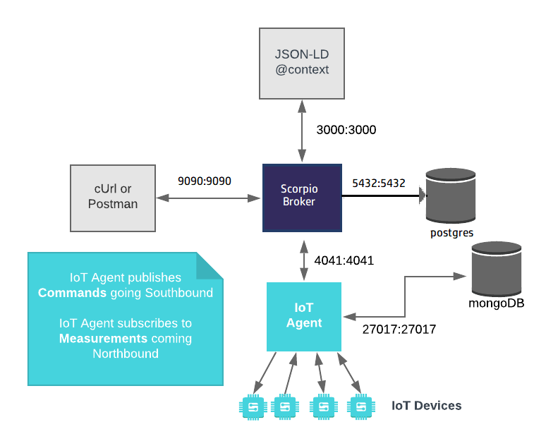
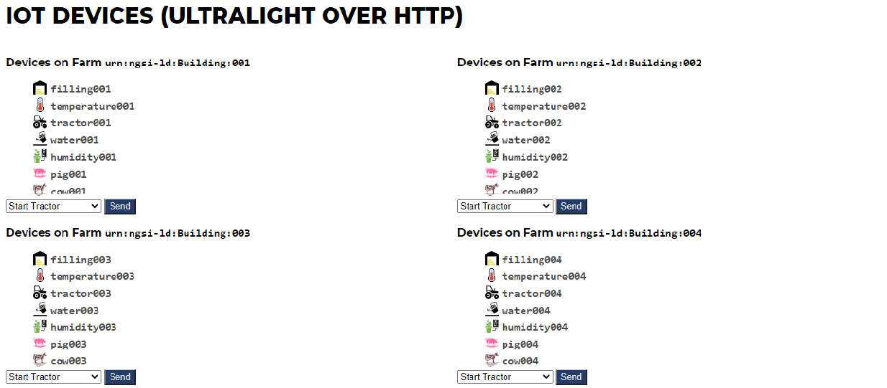
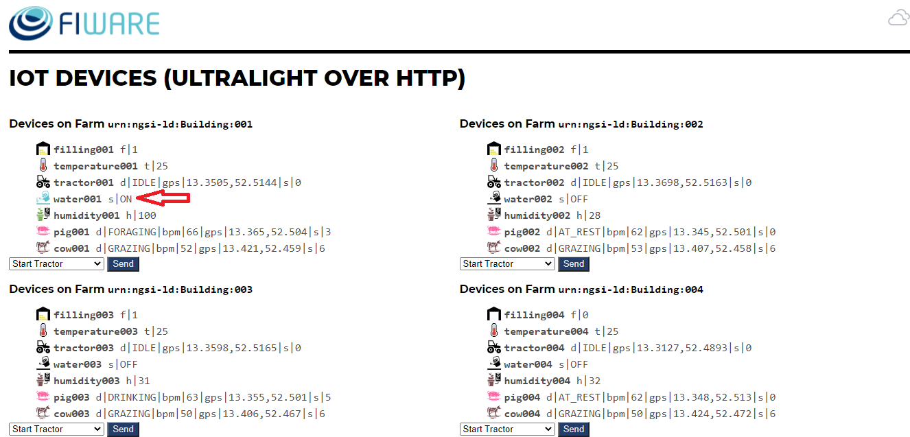
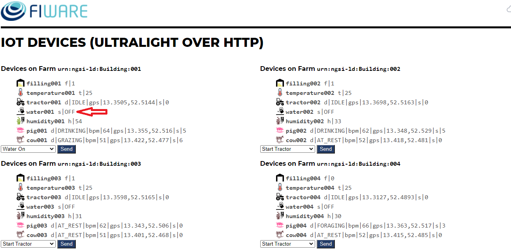

Integrate Scorpio Broker with NGSILD Based IoT agent 
****************************************************

This tutorial introduces the concept of an integration of Scorpio Broker with IoT Agent which wires up the dummy UltraLight 2.0 IoT devices so that measurements can be read and commands can be sent using NGSI-LD requests sent to the Scorpio Broker.
 
**IOT AGENT:** An IoT Agent is a component that lets a group of devices send their data to and be managed from a Context Broker using their own native protocols. if someone want to know more about IoT Agent then can refer `Link`_.
There are several IoT Agent in the market which are in production or already workable. 

-   `IoTAgent-JSON`_ - a bridge between HTTP/MQTT messaging (with a JSON payload) and NGSI-LD
-   `IoTAgent-LWM2M`_ - a bridge between the `Lightweight M2M`_ protocol and NGSI-LD
-   `IoTAgent-UL`_ - a bridge between HTTP/MQTT messaging (with a JSON payload) and NGSI-LD
-   `IoTagent-LoRaWAN`_ - a bridge between the `LoRaWAN`_ protocol and NGSI-LD

.. _`Link`: https://ngsi-ld-tutorials.readthedocs.io/en/latest/iot-agent.html
.. _`IoTAgent-JSON`: https://fiware-iotagent-json.readthedocs.io/en/latest/
.. _`IoTAgent-LWM2M`: https://fiware-iotagent-lwm2m.readthedocs.io/en/latest/
.. _`Lightweight M2M`: https://www.omaspecworks.org/what-is-oma-specworks/iot/lightweight-m2m-lwm2m/
.. _`IoTAgent-UL`: https://fiware-iotagent-ul.readthedocs.io/en/latest
.. _`IoTagent-LoRaWAN`: https://fiware-lorawan.readthedocs.io/en/latest/
.. _`LoRaWAN`: https://www.thethingsnetwork.org/docs/lorawan/

The following diagram shows a simple example of how to do this in details with **IoTAgent-UL**, mainly including four aspects with 10 steps

* The Scorpio Broker which will receive requests using NGSI-LD
* The FIWARE IoT Agent for UltraLight 2.0 which will receive southbound requests using NGSI-LD and convert them to UltraLight 2.0 commands for the devices
* PostgresDB used by the Scorpio Broker to hold context data information such as data entities, subscriptions and registrations
* MongoDB Used by the IoT Agent to hold device information such as device URLs and Keys
* An HTTP Web-Server which offers static @context files defining the context entities within the system.
* The Tutorial Application acts as set of dummy agricultural IoT devices using the UltraLight 2.0 protocol running over HTTP.

Start Up
****************************************************

Please clone the repository and create the necessary images like scorpio broker and IoT agent by running the commands as shown:

.. code-block:: console
    
     git clone https://github.com/ScorpioBroker/ScorpioBroker.git
	 git checkout remote_query
     cd ScorpioBroker/iot-agent/

    ./services scorpio
  
     If you want to clean up and start over again you can do this with the following command:
    
    ./services stop
  
**Note:** version of docker-compose should be greater than 1.21.*.

Before you start the following steps, please check if your Scorpio broker is running properly.

check if the Scorpio broker is running

.. code-block:: console

	curl <scorpio-brokerIP>:9090/ngsi-ld/v1/

check if the IoT Agent broker is running

.. code-block:: console

	curl <IoT-AgentIP>:4041/iot/about

The response will look similar to the following:

.. code-block:: console

	{
		"libVersion": "2.24.0",
		"port": "4041",
		"baseRoot": "/",
		"version": "1.24.0"	
	}
    
check if the IoT Device (Sensor, Actuator)is running properly
	
	Check the status from the Device dashboard

	You can open the device dashboard in your web browser to see the current system status via the URL: **<IoT-DeviceIP>:3000/device/monitor**
	
	Once you are able to access the device dashboard, you can see the following web page

How to Fetch data from IoT Agent to Scorpio Broker
================================================================

**Step 1** Provisioning a Service Group
-----------------------------------------------------------------
Invoking group provision is always the first step in connecting devices since it is always necessary to supply an authentication key with each measurement and the IoT Agent will not initially know which URL the context broker is responding on.

It is also possible to set up default commands and attributes for all anonymous devices as well, but this is not done within this tutorial as we will be provisioning each device separately.

This example provisions an anonymous group of devices. It tells the IoT Agent that a series of devices will be sending messages to the IOTA_HTTP_PORT (where the IoT Agent is listening for Northbound communications data coming from the IOT device)

.. code-block:: console   

	curl -iX POST 'http://<IoT-AgentIP>:4041/iot/services' \
	-H 'fiware-service: openiot' \
	-H 'fiware-servicepath: /' \
	-H 'Content-Type: application/json' \
	--data-raw '{
    	"services": [
        	{
            	"apikey": "4jggokgpepnvsb2uv4s40d59ov",
            	"cbroker": "http://scorpio:9090",
            	"entity_type": "Device",
            	"resource": "/iot/d",
            	"attributes": [
                	{
                    	"object_id": "bpm", "type": "Property", "name": "heartRate",
                    	"metadata": { "unitCode": {"type": "Text", "value": "5K" }}
                	},
                	{
                    	"object_id": "s", "name": "status", "type": "Property"
                	},
                	{
                    	"object_id": "gps", "name": "location", "type": "geo:point"
                	}
            	],
            	"static_attributes": [
                	{
                    	"name": "category", "type": "Property", "value": "sensor"
                	},
                	{
                    "name": "supportedProtocol", "type": "Property", "value": "ul20"
                	}
            	]
        	}
    	   ]
	}'

cbroker in the example is location of Context-Broker where IoT Agent can pass any measurements received to the correct location. cbroker is an optional attribute - if it is not provided, the IoT Agent uses the context broker URL as defined in the configuration file, however it has been included here for completeness.

**Note:** To know about Fiware-Service and Fiware-ServicePath please click  `here`_

.. _`here`: https://ngsi-ld-tutorials.readthedocs.io/en/latest/iot-agent.html#connecting-iot-devices

In the example the IoT Agent is informed that the `/iot/d` endpoint will be used and that devices will authenticate
themselves by including the token **4jggokgpepnvsb2uv4s40d59ov**. For an UltraLight IoT Agent this means devices will be
sending GET or POST requests to:**http://iot-agent:7896/iot/d?i=<device_id>&k=4jggokgpepnvsb2uv4s40d59ov**

**Step 2** Provisioning an Actuator
----------------------------------
The example below provisions a waterPump with the `deviceId=water001`. The endpoint is
`http://iot-sensors:3001/iot/water001` and it can accept the "on" command. The `transport=HTTP` attribute defines the
communications protocol to be used.

.. code-block:: console  

	curl -L -X POST 'http://<IoT-AgentIP>:4041/iot/devices' \
    	-H 'fiware-service: openiot' \
    	-H 'fiware-servicepath: /' \
    	-H 'Content-Type: application/json' \
	--data-raw '
		{
	"devices": [{
		"device_id": "water001",
		"entity_name": "urn:ngsi-ld:Device:water001",
		"entity_type": "Device",
		"protocol": "PDI-IoTA-UltraLight",
		"transport": "HTTP",
		"endpoint": "http://<IoT-DeviceIP>:3001/iot/water001",
		"commands": [{
				"name": "on",
				"type": "command"
			},
			{
				"name": "off",
				"type": "command"
			}
		],
		"static_attributes": [{
			"name": "controlledAsset",
			"type": "Relationship",
			"value": "urn:ngsi-ld:Building:barn001"
		}]
	    }]
	}'

**step 3** IoT Agent records the measurement of Actuator after Provisioning the Actuator on it and forward the measurement to Scorpio. Execute the following command to retrieve the recorded measurement of actuator from Scorpio

.. code-block:: console 

	curl -L -X GET 'http://<scorpio-brokerIP>:9090/ngsi-ld/v1/entities/urn:ngsi-ld:Device:water001' \
   	-H 'NGSILD-Tenant: openiot' \
   	-H 'Link: <https://fiware.github.io/data-models/context.jsonld>; rel="https://uri.etsi.org/ngsi-ld/v1/ngsi-ld-core-context-v1.3.jsonld"; type="application/ld+json"' \
        -H 'Content-Type: application/json' 

Response
-------------------

.. code-block:: console 

	{
		"id": "urn:ngsi-ld:Device:water001",
		"type": "Device",
		"category": {
			"type": "Property",
			"value": "sensor"
		},
		"controlledAsset": {
			"type": "Relationship",
			"object": "urn:ngsi-ld:Building:barn001"
		},
		"off_info": {
			"type": "Property",
			"value": {
				"type": "commandResult",
				"@value": " "
			}
		},
		"off_status": {
			"type": "Property",
			"value": {
				"type": "commandStatus",
				"@value": "UNKNOWN"
			}
		},
		"on_info": {
			"type": "Property",
			"value": {
				"type": "commandResult",
				"@value": " "
			}
		},
		"on_status": {
			"type": "Property",
			"value": {
				"type": "commandStatus",
				"@value": "UNKNOWN"
			}
		},
		"supportedProtocol": {
			"type": "Property",
			"value": "ul20"
		},
		"location": {
			"type": "GeoProperty",
			"value": {
				"type": "Point",
				"coordinates": [
					0,
					0
				]
			}
		}
	}
	

**Step 4** To observe the state of the water sprinkler change through device monitor URL:**<IoT-DeviceIP>:3000/device/monitor** send the below PATCH request directly to the IoT Agent's North Port

.. code-block:: console 

	curl -L -X PATCH 'http://<IoT-AgentIP>:4041/ngsi-ld/v1/entities/urn:ngsi-ld:Device:water001/attrs/on' \
    	-H 'fiware-service: openiot' \
    	-H 'fiware-servicepath: /' \
    	-H 'Content-Type: application/json' \
	--data-raw '{

        	"type": "Property",
        	"value": " "

	}'
	
To verify the status of entity **urn:ngsi-ld:Device:water001** open the device dashboard in your web browser by using URL: **<IoT-DeviceIP>:3000/device/monitor** . The status should be "on".

		

**step 5** IoT Agent receives the command on Patch and forward the measurement to Scorpio. Execute the following command to retrieve the recorded measurement of actuator from Scorpio.

.. code-block:: console 

	curl -L -X GET 'http://<scorpio-brokerIP>:9090/ngsi-ld/v1/entities/urn:ngsi-ld:Device:water001' \
   	-H 'NGSILD-Tenant: openiot' \
   	-H 'Link: <https://fiware.github.io/data-models/context.jsonld>; rel="https://uri.etsi.org/ngsi-ld/v1/ngsi-ld-core-context-v1.3.jsonld"; type="application/ld+json"' \
        -H 'Content-Type: application/json' 

Response
-------------------

.. code-block:: console 

	{
		"id": "urn:ngsi-ld:Device:water001",
		"type": "Device",
		"category": {
			"type": "Property",
			"value": "sensor",
			"observedAt": "2022-11-25T07:10:27.928Z"
		},
		"controlledAsset": {
			"type": "Relationship",
			"object": "urn:ngsi-ld:Building:barn001",
			"observedAt": "2022-11-25T07:10:27.928Z"
		},
		"off_info": {
			"type": "Property",
			"value": {
				"type": "commandResult",
				"@value": " "
			}
		},
		"off_status": {
			"type": "Property",
			"value": {
				"type": "commandStatus",
				"@value": "UNKNOWN"
			}
		},
		"on_info": {
			"type": "Property",
			"value": {
				"type": "commandResult",
				"@value": " on OK"
			},
			"observedAt": "2022-11-25T07:10:27.928Z"
		},
		"on_status": {
			"type": "Property",
			"value": {
				"type": "commandStatus",
				"@value": "OK"
			},
			"observedAt": "2022-11-25T07:10:27.928Z"
		},
		"supportedProtocol": {
			"type": "Property",
			"value": "ul20",
			"observedAt": "2022-11-25T07:10:27.928Z"
		},
		"location": {
			"type": "GeoProperty",
			"value": {
				"type": "Point",
				"coordinates": [
					0,
					0
				]
			}
		}
	}

**Step 6** send the below PATCH request to Enable Scorpio-Broker commands
-------------------------------------------------------------------

.. code-block:: console 

	curl -L -X PATCH 'http://<scorpio-brokerIP>:9090/ngsi-ld/v1/entities/urn:ngsi-ld:Device:water001/attrs/off' \
	-H 'NGSILD-Tenant: openiot' \
	-H 'Accept: application/ld+json' \
	-H 'Link: <https://fiware.github.io/data-models/context.jsonld>; rel="https://uri.etsi.org/ngsi-ld/v1/ngsi-ld-core-context-v1.3.jsonld"; type="application/ld+json"' \
	-H 'Content-Type: application/json' \
	--data-raw '{

        	"type": "Property",
        	"value": " "

	}'
	
**Step 7**:Open the device dashboard in your web browser by using URL: **<IoT-DeviceIP>:3000/device/monitor**, the status of water001  should be "off"

