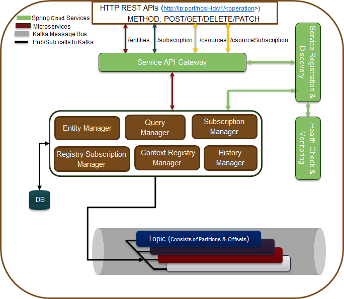

*****************************************
Architecture
*****************************************
The deployment architecture leverages the Spring Cloud framework that addresses lots of Micro-services concerns(e.g. scaling, monitoring, fault-tolerant, highly available, secure, decoupled, etc. ) and Kafka based distributed and scalable message queue infrastructure to provide high performance on message processing for a huge number of context requests which is usual in the IoT domain.

It covers the high-level operations (HTTP based REST with method POST/GET/DELETE/PATCH) request flow from the external world to the Scorpio Broker system.  The external request is served through a unified service API gateway interface that exposes a single IP/port combination to be used for all services that the Scorpio Broker system can provide. In reality, each of the Scorpio Broker services have been implemented as a micro-service that can be deployed as an independent standalone unit in a distributed computing environment. ThE API gateway routes all the incoming requests to the specific Micro-services with the help of THE registration & discovery service. Once the request reaches a micro-service based on the operation requirement it uses(pub/sub) Kafka topics (message queues) for real-time storage and for providing intercommunication among different micro-services (based on requirement) over message queues.

.. figure:: figures/architecture.png

- **Application**: End-user/domain applications leverage Scorpio Broker to provide the required information about IoT infrastructure. This application can query, subscribe, update context information to/from the Scorpio Broker as per their requirements.
- **Consumers**: These are the IoT entities or applications that consume the data of Scorpio Broker.
- **Producers**: These are the IoT entities, context source, or applications that produce the context data to the Scorpio Broker.
- **Service API Gateway**: This is the proxy gateway for the external world to access the internal services of the Scorpio Broker system exposed via REST-based HTTP interfaces. All internal Scorpio Broker related services can be accessed through this service gateway using its single IP & port (which are usually static) and extending the service name in the URL. Thus the user does not need to take care of (or learn or use) the IP and Port of every service which often changes dynamically. This makes life easier, especially in a case when multiple services (or micro-service) are running under one system. This is easily solved by the use of proxy gateway(i.e. service API gateway) for all the back-end services.
- **Rest Interface**: These are the HTTP based interfaces for the external entities/applications to consume in order to execute certain operations on Scorpio Broker. The external interface would be visible through the Service API gateway and internal interface mapping to each requested service would be discovered through the service registration & discovery module.
- **Service Discovery & Registration**: This component allows registration of any service (web service/micro-service) with it so that any client using discovery functionality of this component can determine the location of a service instance to which it wants to send requests. So in short, a service registry & discovery implements a database of services, their instances, and their locations. Service instances get registered with the service registry on startup and deregistered on shutdown. A client of the service, query the service registry, which discovers the available instances of a service. A service registry might also invoke a service instance’s health check API to verify that it is able to handle requests.
- **Entity Manager**: This component handles all entity related CRUD operations with the help of other components of the Scorpio Broker.
- **LD Context Resolver**: This component is responsible for expanding the NGSI-LD document based on the JSON-LD @context for further processing by the other components of the Scorpio Broker.
- **Subscription & Notification Manager**: This component is responsible for handling CRUD operations related to entities and/or csource subscription & notification.
- **Query Manager**: This component handles simple or complex queries (e.g. geo-query) to the Scorpio Broker. 
- **Storage Manager**: This component is responsible for fetching data from the message broker and then transforming them into relevant schema format in order to persist in DB tables. Additionally, this manager also provides interfaces for complex queries to the DB e.g. Geo query or cross-domain entity context relationship queries.
- **Context Registry Manager**: This component is responsible for providing interfaces for CRUD operations of csource registration/query/ subscription.
- **Health Check & Monitoring**: This component is responsible for monitoring the health of running services & infrastructure.
- **Message Bus Handler**: Every module of the Scorpio Broker may need to communicate with the bus for the inter-module exchange of messages. This interface is provided by the message bus handler.
- **Storage Connectors**: The Scorpio Broker needs to store certain information in different DB formats. So storage connectors (using any type of message broker methodology) provide the way to connect to those storage systems (which may be present locally or remotely). For example, the entity information could be stored in/streamed to a different types of storage systems e.g. MySQL, PostgreSQL, Bigdata, etc. These connectors could also be implemented for storage resiliency purposes.
- **Context Registry Connector**: Scorpio Broker needs to communicate to the context registry in order to know about the registered context sources (brokers/providers) and the type of data model they support. The context registry connector allows the message broker mechanism to connect to the context registry that may be running locally or remotely in federated mode.
- **Storage**: This is the actual storage (e.g. Postgres/Postgis) where data is persisted. 
- **Context Registry**: This is the component which is responsible for saving the registration of the context sources/producers. 

*****************************************
Deployment Architecture
*****************************************

This section is covering the deployment architecture of the Scorpio Broker which is using different technologies stack.  

The deployment architecture leverages the Spring Cloud framework that addresses lots of Micro-services concerns(e.g. scaling, monitoring, fault-tolerant, highly available, secure, decoupled, etc. ) and Kafka based distributed and scalable message queue infrastructure to provide high performance on message processing for a huge number of context requests which is usual in the IoT domain. The deployment architecture covers the high-level operations (Http based REST with method POST/GET/DELETE/PATCH) request flow from the external world to the Scorpio Broker system.  The external request is served through a unified service API gateway interface that exposes a single IP/port combination to be used for all services that the Scorpio Broker system can provide. In reality, each of the Scorpio Broker services will be implemented as a micro-service that can be deployed as an independent standalone unit in a distributed computing environment. That API gateway routes all the incoming requests to the specific Micro-services with the help of registration & discovery service. Once the request reaches at micro-service based on the operation requirement it uses(pub/sub) Kafka topics (message queues) for real-time storage and for providing intercommunication among different micro-services (based on requirement) over message queues.