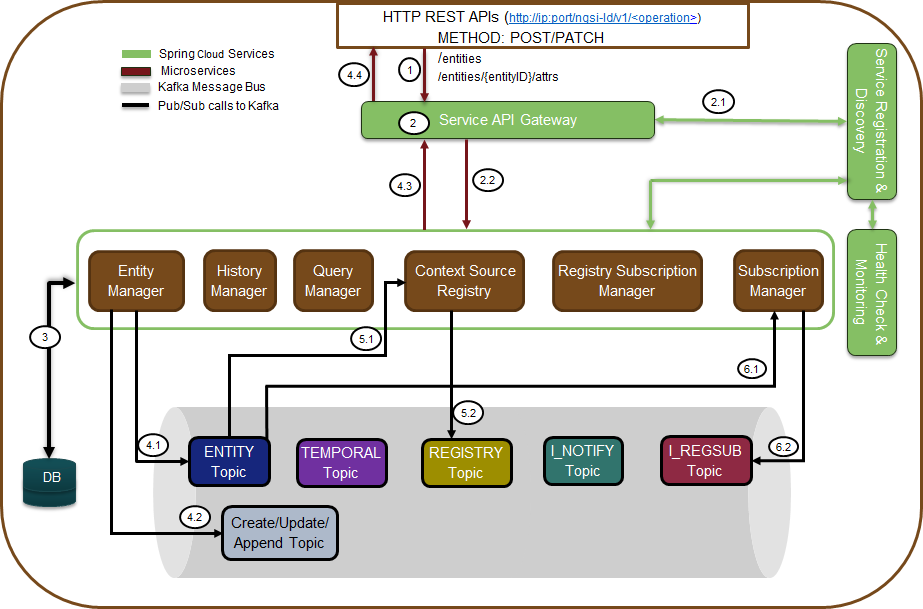
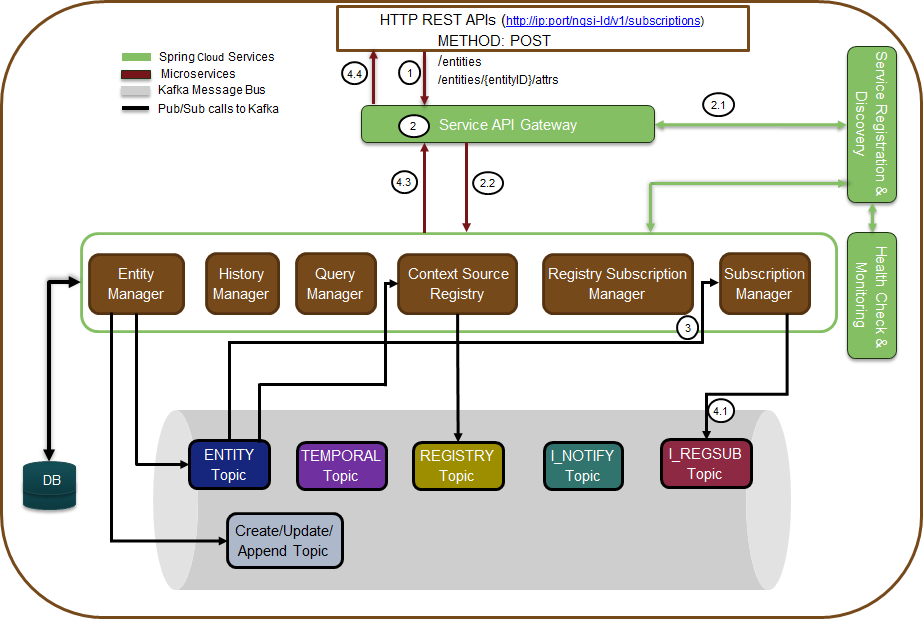
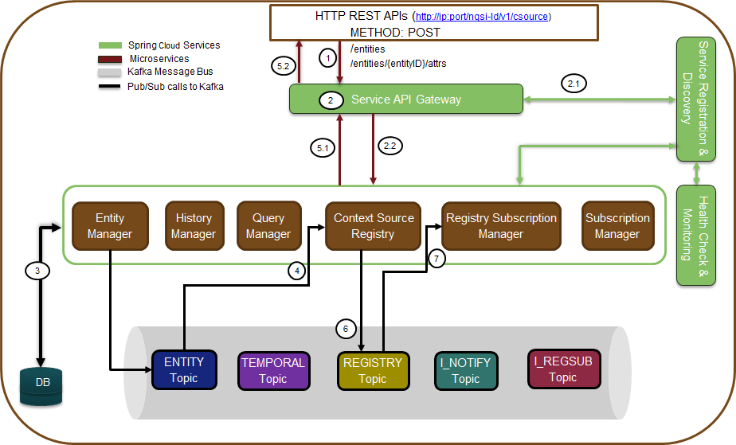

********************
オペレーションフロー
********************

エンティティの作成/更新/追加
############################

この図は、Scorpio Broker システムでのエンティティの作成/更新/追加 (create/update/append) の操作フローを示しています。
マークされたステップの解釈は次のとおりです。

1. アプリケーションは、NGSI-LD 準拠のインターフェイス (Service API gateway によって公開) を呼び出して、HTTP POST
   リクエストの形式でエンティティを作成/更新/追加します。

2. リクエストは Service API gateway に入ります。

2.1. Service API gateway は、Discovery & registry service から、実際にサービスを提供しているマイクロサービス
エンドポイント (着信要求を転送する必要がある場所) を検出します。

2.2. Service API gateway は、HTTP リクエストを Entity Manager マイクロサービスに転送します。

3. Entity Manager は、内部で LDContext resolver service を呼び出して、POST リクエストとともに送信された特定の
   コンテキストでペイロードを解決します。ペイロードがコンテキストで解決されると、トピック “Entities” から以前に
   保存されたデータ/エンティティをフェッチし、EntityID に基づいて既存の保存されたエンティティに対して要求された
   エンティティを検証します。

-   エンティティがすでに存在する場合 (または変更が要求されているすべての属性と値を含む場合)、エラーメッセージ
    (“already exists”) が同じものに対して応答され、それ以上のステップは実行されません。

-   それ以外の場合は、さらに処理するために移動します。

4. Entity Manager (EM) は、次のように、要求されたエンティティ (E1) 作成操作の公開/保存を行い、要求者に応答を送信します。

4.1. EM は、トピック “Entities” の下で Kafka に E1 をパブリッシュします。

4.2. EM は、トピック “Entity_Create/Update/Append” の下の Kafka でも E1 をパブリッシュしています。

4.3. パブリッシュの操作が成功すると、EM は応答を送り返します。

**注意**: “Entities” トピックは、エンティティの作成/更新/追加操作のいずれかによって一定期間に行われたエンティティの
すべての変更を保存します。ただし、“Entity_Create/Update/Append” トピック (CREATE 操作に固有) は、エンティティ作成操作の
データ変更のみを保存します。操作ごとに異なるトピックを持つことで、異なる消費者間の異なる要件間のあいまいな状況を
回避できます。たとえば、サブスクリプションマネージャーは、エンティティ全体、特定の属性のセットをサブスクライブする必要が
ある場合や、特定の属性の値の変更である場合があります。したがって、操作ごとに個別のトピックが維持されていない場合、
これらすべての要件を管理することは困難であり、操作ごとに個別のトピックが維持されている場合、任意の時点で特定の
エンティティのデータに直接デルタ変更を 提供するために非常に単純化されます。したがって、すべての運用データを1つのトピック
にまとめても、運用、データ、またはデルタデータレベルの要件でサブスクライブ/管理するために必要なデカップリング、簡素化、
および柔軟性を提供することはできません。そのため、操作ごとに個別のトピックを作成し、(一定期間にわたるすべての操作の
エンティティ全体の変更を検証する必要がある) 特定のエンティティに対するすべての操作のすべての変更 を記録するための1つの
共通トピックを作成することが設計上の好ましい選択です。指定されたペイロードのコンテキストは、LDContext resolver service
によって、AtContext という名前で Kafka トピックに格納されています。

5. メッセージが Kafka トピックに公開されると、そのトピックのコンシューマーは、それらのトピックをサブスクライブまたは
   リッスンしたユーザーにノーティフィケーションされます。この場合、ノーティフィケーションを受け取った
   “Entity Create/Update/Append” トピックのコンシューマーは、次のことを行います:

5.1. サブスクリプションマネージャーは、関連エンティティのノーティフィケーションを受け取ると、現在のエンティティの
ノーティフィケーション検証をチェックし、それに応じてノーティフィケーションを送信する必要があるかどうかをチェックします。

5.2. Storage Manager は、エンティティと CR トピックからのノーティフィケーションに応じて、エンティティ関連の変更を DB
テーブルに格納/変更するための追加の操作をトリガーします。

6. これで、エンティティマネージャーは、Context Registry へのエンティティデータモデルのレジストレーションの準備もします。
   以下は、同じことを達成するために実行するその他の機能です:

6.1. そのため、エンティティペイロードから Csource registration ペイロード (NGSI_LD 仕様セクション C.3 による）を準備し、
必要なフィールド (ID, ブローカー IP としてのエンドポイント、ロケーションなど) に入力します。その後、
エンティティマネージャは、この作成された Csource ペイロードを CR トピックに書き込みます。

6.2. CR Manager は、この CR トピックをリッスンし、一部のエンティティがレジストレーションされたことを知ることができます。

6.3. CR Manager は、更新がある場合は、Csource トピックに書き込みます。

エンティティのサブスクリプション
################################

この図は、ScorpioBroker システムでのエンティティサブスクリプションの運用フローを示しています。マークされたステップの
解釈は次のとおりです。

1. アプリケーションは、(Service API gateway によって公開される) NGSI-LD 準拠のインターフェイスを呼び出して、HTTP POST
   要求の形式でエンティティ (または属性) をサブスクライブします。

2. リクエストは Service API gateway に入ります。

2.1. Service API gateway は、Discovery & registry service から、実際にサービスを提供しているマイクロサービス
エンドポイント (着信要求を転送する必要がある場所) を検出します。

2.2. Service API gateway は、HTTP リクエストを Subscription Manager マイクロサービスに転送します。

3. Subscription Manager は、内部で LDContext resolver service を呼び出して、POST リクエストとともに送信された特定の
   コンテキストでペイロードを解決します。次に、サブスクリプションマネージャーは、トピック “Subscription” から以前に
   保存されたデータ/エンティティをフェッチし、EntityID に基づいて既存の保存された値に対して要求されたエンティティを
   検証します。

-   現在のリクエストのデータがすでに存在する場合は、同じメッセージに対してエラーメッセージが応答され、それ以上の
    ステップは実行されません。

-   それ以外の場合は、さらに処理するために移動します。

4. Subscription Manager (SM) は、次のように要求された操作に対する応答をパブリッシュ/ストアし、要求者に送信します。

4.1. SM はトピック “Subscription” の下でサブスクリプション S(E1) を Kafka に公開します。

4.2. SM はノーティフィケーション機能を開始し、関連するサブスクリプションのリッスンをスタート/キープします。

4.2.1. エンティティ関連のトピック “Create/Update/Append”

4.2.2. コンテキストソース関連のトピック、つまり、コンテキストソースの将来の登録のための “CSource” トピック。これを
行うことで、すでにサブスクライブされているアイテム/エンティティの Csource を CR に明示的にクエリする必要がなくなります。

4.2.3. 発生した特定のクエリの結果を収集するための CRQueryResult トピック (存在する場合)。

4.2.4. サブスクリプション要求のサブスクリプション条件が成功すると、SM はサブスクライブされたエンティティに指定された
エンドポイントにノーティフィケーションします。また、コンテキストレジストリによって提供されるコンテキストソースへの
リモートサブスクリプションも実行します。

4.3. Pub の操作が成功すると、SM は応答を送り返します

5. SM は、オプションで、受信したサブスクリプション要求ごとに CRQuery トピックに投稿することでクエリを CR に上げることが
できます (サブスクリプション要求ごとに1回のみ)。メッセージが CRQuery トピックに公開されると、このトピックを
サブスクライブまたはリッスンしたユーザーにコンシューマー CR にノーティフィケーションされます。これで、CR
は次のことを行います。

5.1. CR はノーティフィケーションを受信し、このサブスクリプションが有効である可能性のある CR トピックおよび/または
CsourceSub トピックからデータをプルすることにより、コンテキストソースのリストを確認します。

5.2. CR は、コンテキストソースのリストを CRQueryResult トピックに公開します。このトピックでは、SM がすでにリッスンを
開始し、手順4.2.3と4.2.4を繰り返します。
   
**注意**: Csource トピックには、Csource レジストレーションインターフェイスを介して直接レジストレーションされた
コンテキストソースのリストが含まれます。CR トピックには、(IoT broker インターフェイスを介して) エンティティ作成要求
および/またはそのエンティティモデルのプロバイダー/データソースに基づいて作成されたエンティティデータモデル
(エンティティ ID として維持) のマップが含まれます。制限事項: Scorpio Broker の最初のリリースでは、Csource クエリは
サポートされていません。代わりに、Csource クエリは内部メッセージングキューメカニズムに基づいています。将来的には、
メッセージキューと REST ベースの Csource クエリの両方がサポートされる予定です。

クエリー
########

.. figure:: ../../en/source/figures/flow-3.png

この図は、Scorpio Broker システムでのエンティティサブスクリプションの運用フローを示しています。マークされたステップの
解釈は次のとおりです。

1. アプリケーションは、NGSI-LD 準拠のインターフェース (Service API gateway によって公開される) を呼び出して、HTTP GET
   要求の形式でエンティティ/エンティティ/属性をクエリします。

2. リクエストは Service API gateway に入ります。

2.1. Service API gateway は、Discovery & registry service から、実際にサービスを提供しているマイクロサービス
エンドポイント (着信要求を転送する必要がある場所) を検出します。

2.2. Service API gateway は、HTTP リクエストを Query Manager マイクロサービスに転送します。

3. クエリマネージャは、トピック “Entities” から以前に保存されたデータ/エンティティをフェッチするようになりました。

-   クエリがすべてのエンティティに対するものであるか、ID や属性を持つ特定のエンティティが要求された場合、これは、
    ストレージマネージャーを関与させることなく、クエリマネージャーによって Kafka エンティティトピックデータに基づいて
    直接提供されます。つまり、geo 以外のクエリや、1つまたは複数のエンティティに関連付けられた正規表現クエリのない
    単純なクエリを直接処理できます。この場合、応答が返送され、処理はステップ7.2 にジャンプします。

-   複雑なクエリの場合、クエリマネージャは、次の手順で説明するように、ストレージマネージャの支援を受けます。

4. クエリマネージャー (複雑なクエリの場合) は、ストレージマネージャーがリッスンしているクエリトピックにクエリ
   (メッセージやその他のメタデータで使用されるものを埋め込む) を公開します。

5. ストレージマネージャーは、要求されたクエリのノーティフィケーションを受け取り、DB データに対するクエリの処理を開始し、
   クエリ応答を作成します。

6. ストレージマネージャーは、クエリマネージャーがリッスンしているクエリトピックでクエリの応答をパブリッシュします。

7. QM は、QueryResult トピックからノーティフィケーションを受け取ります。

7.1. HTTP 応答を API gateway に送り返します。

7.2. API gateway は、エンドユーザー/リクエスターに応答を送り返します。

コンテキストソース登録
######################

この図は、ScorpioBroker システムでのコンテキストソースレジストレーションの操作フローを示しています。マークされた
ステップの解釈は次のとおりです:

1. アプリケーションは、HTTP POST リクエストの形式で (Service API gateway によって公開される) NGSI-LD 準拠の
   インターフェイスから Csource registration を呼び出します。

2. リクエストは Service API gateway に入ります。

a. Service API gateway は、Discovery & registry service から、実際にサービスを提供しているマイクロサービス
エンドポイント (着信要求を転送する必要がある場所) を検出します。

b. Service API gateway は、HTTP リクエストを Context Registry (CR) Manager マイクロサービスに転送します。

3. CR manager は、以前に保存されたデータ/エンティティをトピック "CSource" からフェッチするようになりました。

a. リクエスト Csource のエントリがすでに存在する場合、処理を終了し、リクエスターにノーティフィケーションします。
存在しない場合は、さらに処理を続行します。

b. これで、CR manager はいくつかの基本的な検証を実行して、これが有効なペイロードを持つ有効な要求であるかどうかを
確認します。

c. CR manager は、このペイロードを Csource トピックに書き込むようになりました。

4. Storage Manager は、Csource トピックをリッスンし続け、新しいエントリの書き込みがある場合は、データベースで相対操作を
実行します。

5. CR manager は、Csource 要求に対する応答を準備します。

5.1. HTTP 応答を API gateway に送り返します。

5.2. API gateway は、応答をエンドユーザー/リクエスターに送り返します。

**注意**: Conext Source Update リクエストの場合、ペイロードのみが変更を取得し、ステップ3 で既存のエンティティの検証時に
終了せず、取得したエンティティを更新して Kafka に書き戻します。残りのフローはほとんど同じままです。

コンテキストソースのサブスクリプション
######################################

.. figure:: ../../en/source/figures/flow-5.png

図の ScorpioBroker コンテキストソースサブスクリプションフローは、ScorpioBroker システムでのコンテキストソース
サブスクリプションの運用フローを示しています。マークされたステップの解釈は次のとおりです:

1. アプリケーションは、HTTP POST リクエストの形式で (Service API gateway によって公開される) NGSI-LD 準拠の
   インターフェイスから、Csource updates  を呼び出します。

2. リクエストは Service API gateway に入ります。

a. Service API gateway は、Discovery & registry serviceから、実際にサービスを提供しているマイクロサービス
エンドポイント (着信要求を転送する必要がある場所)を検出します。

b. Service API gateway は、HTTP リクエストを Context Registry (CR) Manager マイクロサービスに転送します。

3. CR manager は、以前に保存されたデータ/エンティティをトピック "CSourceSub" からフェッチするようになりました。

a. ここで、CR manager はいくつかの基本的な検証を実行して、これが有効なペイロードを持つ有効な要求であるかどうかを
確認します。

b. リクエスト Csource subscription のエントリがすでに存在する場合、処理を終了し、リクエスターにノーティフィケーション
します。存在しない場合は、さらに処理を続行します。

c. CR manager は、このペイロードを CsourceSub トピックに書き込みます。

d. 並行して、要求されたサブスクリプションについて Csource トピックをリッスンする独立したスレッドも開始し、正常な状態に
なると、サブスクリプションペイロードで提供される登録済みエンドポイントにノーティフィケーションが送信されます。

4. Storage Manager は、CsourceSub トピックをリッスンし続け、新規/更新されたエントリの書き込みについては、データベースで
   相対操作を実行します。

5. CR manager は、Csource subscription 要求の応答を準備し、

5.1. HTTP 応答をAPI gateway に送り返します。

5.2. API gateway は、応答をエンドユーザー/リクエスターに送り返します。

ヒストリー (履歴)
#################

.. figure:: ../../en/source/figures/flow-6.png

この図は、ScorpioBroker システムでのエンティティサブスクリプションの運用フローを示しています。マークされたステップの
解釈は次のとおりです:

1. アプリケーションは、HTTP POST リクエストの形式で、(Service API gateway によって公開される) NGSI-LD 準拠の
   インターフェイスから History manager を呼び出します。

2. リクエストは Service API gateway に入ります。

a. Service API gateway は、Discovery & registry service から、実際にサービスを提供しているマイクロサービス
エンドポイント (着信要求を転送する必要がある場所) を検出します。

b. Service API gateway は、HTTP リクエストを History manager マイクロサービスに転送します。

3. History manager は、受信したペイロードに対して EVA アルゴリズムアプローチを実行し、ペイロード属性を Kafka トピック
“TEMPORALENTITY” にプッシュします。

**注意**: History Manager は、オブジェクトのルートレベルで各属性をウォークスルーする必要があります
(@id と @type を除く)。各属性内で、各インスタンス (配列要素) をウォークスルーする必要があります。次に、現在の
オブジェクトを Kafka トピック TEMPORALENTITY に送信します。

4. History Manager は、"TEMPORALENTITY" トピックと新しいエントリをリッスンし続け、データベースで相対操作を実行します。
