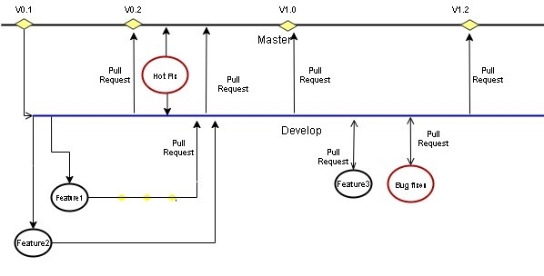

********************************
コントリビューションガイドライン
********************************

ブランチ管理ガイドライン
########################

コミュニティは、無限の存続期間を持つ2つの主要なブランチを持つことができます:

1.  **Master branch**: これは非常に安定したブランチであり、常に本番環境に対応しており、本番環境でのソースコードの
    最新リリースバージョンが含まれています。
2.  **Development branch**: マスターブランチから派生した開発ブランチは、次のリリースで計画されているさまざまな機能を
    統合するためのブランチとして機能します。このブランチは、マスターブランチほど安定している場合とそうでない場合が
    あります。これは、開発者がコラボレーションして機能ブランチをマージする場所です。すべての変更は、何らかの方法で
    マスターにマージして戻し、リリース番号でタグ付けする必要があります。

これらの2つの主要なブランチとは別に、ワークフローには他のブランチがあります:

-   **Feature Branch**: 機能開発、つまり拡張またはドキュメント化のために開発ブランチから分岐します。機能開発または
    拡張機能の実装後、開発ブランチにマージされました。
-   **Bug Branch**: 開発ブランチから分岐します。バグ修正後、開発ブランチにマージされました。
-   **Hotfix branch**: 修正プログラムブランチは、マスターブランチから作成されます。これは現在の製品リリースであり、
    ライブで実行されており、重大なバグが原因で問題が発生しています。しかし、開発の変化はまだ不安定です。その後、
    ホットフィックスブランチから分岐して、問題の修正を開始する場合があります。重大なバグのみの場合、これは最もまれな
    機会であるはずです。

**注意**: 修正プログラムブランチを作成およびマージする権限を持っているのは、NLE および NECTI メンバーのみです。

+------------------+-------------------------------------------------------------------------------------------------------------------------------------+-----------------------------------------------------------------------------------------------------+
| ブランチ         | ブランチ命名ガイドライン                                                                                                            | 備考                                                                                                |
+==================+=====================================================================================================================================+=====================================================================================================+
| Feature branches | *development* から分岐する必要があります。*development* にマージして戻す必要があります。ブランチの命名規則: *feature-feature_id*    | *feature_id* は、**https://github.com/ScorpioBroker/ScorpioBroker/issues** の Github Issue ID です。|
+------------------+-------------------------------------------------------------------------------------------------------------------------------------+-----------------------------------------------------------------------------------------------------+
| Bug Branches     | *development* から分岐する必要があります。*development* にマージして戻す必要があります。ブランチの命名規則: *bug-bug_id*            | *bug_id* は、**https://github.com/ScorpioBroker/ScorpioBroker/issues** の Github Issue ID です。    |
+------------------+-------------------------------------------------------------------------------------------------------------------------------------+-----------------------------------------------------------------------------------------------------+
| Hotfix Branches  | *master branch* から分岐する必要があります。*master branch* にマージして戻す必要があります。ブランチの命名規則: *hotfix-bug number* |*Bug number* は、**https://github.com/ScorpioBroker/ScorpioBroker/issues** の Github Issue ID です。 |
+------------------+-------------------------------------------------------------------------------------------------------------------------------------+-----------------------------------------------------------------------------------------------------+

ブランチへのアクセス許可
************************

-   **Master** - マスターブランチでマージしてプルリクエストを受け入れることができるのは、NEC Laboratories Europe (NLE)
    メンバーと NEC Technologies India (NECTI) の特権メンバーのみであるという非常に厳しい傾向があります。マスターへの
    プルリクエストは、NECTI または NLE メンバーのみが作成できます。
-   **Development** - コミュニティメンバーは誰でもプルリクエストを開発ブランチに提出できますが、NLE または NECTI
    メンバーがレビューする必要があります。開発ブランチのコミットは、NGSI-LD テストスイートで記述されたすべてのテスト
    ケースが正常に実行された場合にのみ、マスターブランチに移動されます。
