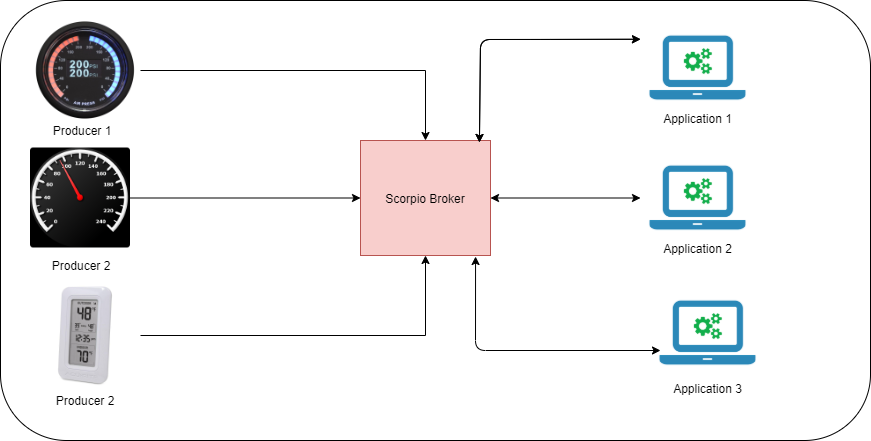

==============
Scorpio Broker
==============

Scorpio Broker は、コンテキストプロデューサーとコンシューマーが相互に対話できる NGSI-LD API を実装します。たとえば、
一般的な IoT ベースの部屋では、温度センサー、光センサーなどのさまざまなセンサーが、これらのセンサー出力を使用して
コンシューマーとして機能する中央アプリケーションに接続されています。この中央アプリケーション、つまり Scorpio には
多くのユースケースがあります。

1. Scorpio は、NGSI-LD API と情報モデルを使用して、エンティティをそのプロパティとリレーションシップでモデル化し、
エンティティをノードとして持つプロパティグラフを形成します。エンティティを検出し、リレーションシップを追跡し、
プロパティ、リレーションシップ、および関連するメタ情報に従ってフィルタリングすることで、情報を見つけることができます。
ビデオストリームや3Dモデルのように NGSI-LD で直接表されていないデータの場合、コンシューマーがこの情報に直接アクセス
できるようにするリンクをモデルに追加できます。このようにして、Scorpio はデータレイクにグラフベースのインデックスを
提供できます。

2. Scorpio は、保存されたデータをクエリするためのいくつかのインターフェイスを提供するため、保存されたデータに対して
簡単に分析を行うことができます。エコシステムの状況を予測するために使用できるように。例: 巨大な建物には、
複数の火災センサー、温度センサー、煙センサーがあります。誤った火災警報器の場合は、収集された特定の地域の火災データ、
温度データ、および煙データによっ検証てできます。

3. Scorpio は、あらゆるイベントの精度を判断するために使用できます。たとえば、自動化された車では、車の速度は GPS、
自動速度取締機、速度計などのいくつかのアプリケーションで知ることができます。Scorpio の内部データはこの方法で保存される
ため、サードパーティのアプリケーションはそれを使用して、正確さを見つけ、障害のあるデバイスを特定できます。

.. toctree::
    :maxdepth: 1
    :caption: イントロダクション
    :numbered:

    introduction.rst

.. toctree::
    :maxdepth: 1
    :caption: ビギナー ガイド
    :numbered:

    onepageTutorial.rst
    buildScorpio.rst
    mqtt.rst

.. toctree::
    :maxdepth: 1
    :caption: FIWARE NGSI-LD API ウォークスルー
    :numbered:

    API_walkthrough.rst
    
.. toctree::
    :maxdepth: 1
    :caption: デベロッパー ガイド
    :numbered:

    installationGuide.rst
    hardwareRequirement.rst
    errorHandling.rst
    security.rst
    HelloWorld.rst
    multivalue.rst

.. toctree::
    :maxdepth: 1
    :caption: アドバンスド ユーザ ガイド
    :numbered:

    systemOverview.rst
    callFlow.rst
    contributionGuideline.rst
    docker.rst
    config.rst
    troubleshooting.rst
