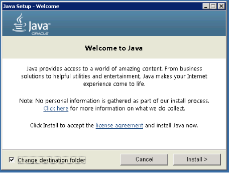

****************************
開発者向けインストールガイド
****************************

Scorpio broker の環境をセットアップするには、次の依存関係を構成する必要があります:-

1. Eclipse.
2. Server JDK.
3. Apache Kafka.
4. PostgreSQL

Windows
#######

Eclipse のインストール
**********************

- **Eclipse のインストーラーをダウンロードします**:

http://www.eclipse.org/downloads.Eclipse から Eclipse インストーラーをダウンロードします。Eclipse は世界中の多くの
ミラーでホストされています。最寄りのものを選択して、インストーラーのダウンロードを開始してください。

- **Eclipse のインストーラー実行可能ファイルを起動します**:

Windows ユーザーの場合、Eclipse インストーラーの後、実行可能ファイルのダウンロードが完了すると、ダウンロード
ディレクトリで利用できるようになります。Eclipse インストーラー実行可能ファイルを起動します。このファイルを実行すると、
セキュリティ警告が表示される場合があります。Eclipse Foundation がパブリッシャーである場合は、Run (実行) を選択します。

Mac および Linux ユーザーの場合でも、インストーラーを作成するにはダウンロードを解凍する必要があります。インストーラーが
利用可能になったら起動します。

- **インストールするパッケージを選択します**:

新しい Eclipse インストーラーは、Eclipse ユーザーが利用できるパッケージを表示します。インストールするパッケージを
検索するか、リストをスクロールできます。インストールするパッケージを選択してクリックします。

- **インストールフォルダを選択します**

Eclipse をインストールするフォルダーを指定します。デフォルトのフォルダはユーザーディレクトリにあります。‘Install’
(インストール) ボタンを選択して、インストールを開始します。

- **Eclipse の起動**

インストールが完了すると、Eclipse を起動できるようになります。Eclipse インストーラーがその作業を完了しました。
ハッピーコーディング。

JDK セットアップ
****************

- JDK のインストールを開始し、“Change destination folder” (インストール先フォルダーの変更) チェックボックスを
  押してから、'Install' をクリックします。

**注意:-** 推奨バージョンは JDK-11 です。Scorpio Broker は、このバージョンでのみ開発およびテストされています。

- インストールディレクトリを、フォルダ名にスペースを入れない任意のパスに変更します。

Windows に Java をインストールした後、Java インストールディレクトリを指すように JAVA_HOME 環境変数を設定する必要が
あります。

**JAVA_HOME 変数を設定**

JAVA_HOME 変数を設定するには:

1. Java がインストールされている場所を調べます。インストール中にパスを変更しなかった場合は、次のようになります:

*C:\Program Files\Java\jdk1.version_detail*

2.

- Windows 8/10では、**Control Panel** > **System** > **Advanced System Settings** に移動します。

  または

- Windows 7では、**My Computer** を右クリックして、**Properties** > **Advanced** を選択します。

3. Environment Variables ボタンをクリックします。

4. System Variables で、New をクリックします。

5. User Variable Name フィールドに、次のように入力します: **JAVA_HOME**

6. User Variable Value フィールドに、JDK パスを入力します。

(Java のパスとバージョンは、使用している Kafka のバージョンによって異なる場合があります)

7. 次に OK をクリックします。

8. 開いたばかりの “Environment Variables” ダイアログボックスの “System Variable” セクションでパス変数を検索します。

9. パスを編集し、下の画像のように、すでにそこに書き込まれているテキストの最後に *;%JAVA_HOME%\bin* と入力します:

.. figure:: ../../en/source/figures/jdk-3.png

- Java のインストールを確認するには、cmd を開いて “java –version” と入力します。インストールした Java のバージョンが表示されるはずです。

.. figure:: ../../en/source/figures/jdk-4.png

コマンドプロンプトが上の画像のようになっている場合は、問題ありません。それ以外の場合は、セットアップバージョンが正しい
OS アーキテクチャ (x86, x64) と一致するかどうか、または環境変数のパスが正しいかどうかを再確認する必要があります。

Kafka のセットアップ
********************

1. Kafka 構成ディレクトリに移動します。
例:- **C:\kafka_2.11-0.9.0.0\config**

2. ファイル “server.properties”
を編集します。

3. "log.dirs=/tmp/kafka-logs” がある行を見つけて
"log.dir= C:\kafka_2.11-0.9.0.0\kafka-logs" に編集します。

4. ZooKeeper が他のマシンまたはクラスターで実行されている場合は、“zookeeper.connect:2181” をカスタムIPとポートに
編集できます。このデモでは、同じマシンを使用しているため、変更する必要はありません。また、Kafka ポートと broker.id
はこのファイルで構成できます。他の設定はそのままにしておきます。

5. Kafka はデフォルトポート 9092 で実行され、
ZooKeeper のデフォルトポート 2181 に接続します。

**注意**: Kafka を実行するには、Zookeeper を最初に実行する必要があります。Kafka を閉じるときは、Kafka よりも Zookeeper
を最初に閉じる必要があります。Kafka の推奨バージョンは kafka_2.12-2.1.0 です。

Kafka サーバーの実行
********************

重要: Kafka サーバーを起動する前に、ZooKeeper インスタンスが稼働していることを確認してください。

1. Kafka インストールディレクトリに移動します: **C:\kafka_2.11-0.9.0.0\**

2. Shift キーを押しながら右クリックしてコマンドプロンプトを開き、“Open command window here” オプションを選択します。

3. 次に、**.\bin\windows\kafka-server-start.bat .\config\server.properties** と入力し、Enter キーを押します。

4. そして、**.\bin\windows\kafka-server-start.bat .\config\server.properties** を新しいコマンドウィンドウにして、Etner キーを押します。

PostgreSQL のセットアップ
*************************

ステップ 1) https://www.postgresql.org/download にアクセスします。

ステップ 2) 2つのオプションがあります:-

1. EnterpriseDB によるインタラクティブインストーラー

2. BigSQL によるグラフィカルインストーラー

BigSQL は現在、非推奨の pgAdmin バージョン3をインストールしています。最新バージョン4をインストールする EnterpriseDB
を選択することをお勧めします。

ステップ 3)

1. 目的の Postgres バージョンとオペレーティングシステムが表示されます。Scorpio はこのバージョンでテストおよび開発されているため、Postgres10 を選択します。

2. ダウンロードボタンをクリックすると、ダウンロードが始まります。

ステップ 4) ダウンロードした .exe ファイルを開き、インストールのようこそ画面で "Next" をクリックします。

ステップ 5) 

1. 必要に応じてインストールディレクトリを変更します。それ以外の場合はデフォルトのままにします。

2. "Next" をクリックします。

ステップ 6)

1. システムにインストールするコンポーネントを選択できます。Stack Builder のチェックを外してもかまいません。

2. "Next" をクリックします。

ステップ 7)

1. データの場所を変更できます

2. "Next" をクリックします。

ステップ 8)

1. スーパーユーザーのパスワードを入力します。それをメモしてください。

2. "Next" をクリックします。

ステップ 9)

1. ポート番号をデフォルトのままにします。

2. "Next" をクリックします。

ステップ 10)

1. インストール前の概要を確認します。

2. "Next" をクリックします。

ステップ 11) "Next" をクリックします。

ステップ 12) インストールが完了すると、Stack Builder プロンプトが表示されます。

1. そのオプションのチェックを外します。より高度なチュートリアルで Stack Builder を使用します。

2. "Finish" をクリック

ステップ 13) Postgres を起動するには、スタートメニューに移動し、pgAdmin 4 を検索します。

ステップ 14) pgAdmin ホームページが表示されます。

ステップ 15) 左側のツリーで、Servers > Postgre SQL 10 をクリックします。

.. figure:: ../../en/source/figures/dbconfig-1.png

ステップ 16)

1. インストール時に設定したスーパーユーザーパスワードを入力します。

2. "OK" をクリックします。

ステップ 17) ダッシュボードが表示されます。

.. figure:: ../../en/source/figures/dbconfig-2.png

PostgreSQL のインストールは以上です。

Linux
#####

JDK セットアップ
****************

マシンに Java 環境を作成するには、JDK をインストールします。これを行うには、ターミナルを開き、次のコマンドを実行します:-

1. sudo apt-get update

2. sudo apt-get install openjdk-8-jdk

JDK がマシンに正しくインストールされていることを確認するには、ターミナルでコマンド **java -version** を実行し、JDK
のバージョンが 11 として返される場合は、正常に機能しています。

.. figure:: ../../en/source/figures/javaTerminal.png

Eclipse のインストール
**********************

最初に Linux マシンに Eclipse をインストールするには、リンク https://www.eclipse.org/downloads/ にアクセスし、Linux
マシンのフレーバーに基づいて Eclipse のバージョンを選択します。

Kafka のセットアップ
********************

マシンに Apache Kafka をダウンロードするには、ターミナルで次のコマンドを1つずつ実行します。

1. mkdir kafka

2. cd kafka

3. wget https://archive.apache.org/dist/kafka/2.2.0/kafka_2.12-2.2.0.tgz

4. tar -xzf kafka_2.12-2.2.0.tgz

Kafka がマシンにダウンロードされたら、次のコマンドを押して実行します。

1. kafka_2.12-2.2.0/bin/zookeeper-server-start.sh kafka_2.12-2.2.0/config/zookeeper.properties > /dev/null 2>&1 &

2. kafka_2.12-2.2.0/bin/kafka-server-start.sh kafka_2.12-2.2.0/config/server.properties > /dev/null 2>&1 &

PostgreSQL のセットアップ
*************************

マシンに PostgreSQL をダウンロードするには、ターミナルから次のコマンドを実行します。

1. sudo apt update

2. sudo apt-get install postgresql-10

3. service postgresql status

最後のコマンドは、マシンの PostgreSQL のステータスを示します。これが図の1つと一致する場合は、すべてが正しくインストール
されています。それ以外の場合は、コマンドを再実行します。

.. figure:: ../../en/source/figures/postgresTerminal.png

PostgreSQL がマシンに正常にインストールされたら、データベース ngb を作成し、次のコマンドを実行してその役割を変更します:

1.	psql -U postgres -c "create database ngb;"

2.	psql -U postgres -c "create user ngb with password 'ngb';"

3.	psql -U postgres -c "alter database ngb owner to ngb;"

4.	psql -U postgres -c "grant all privileges on database ngb to ngb;"

5.	psql -U postgres -c "alter role ngb superuser;"

6.	sudo apt install postgresql-10-postgis-2.4

7.	sudo apt install postgresql-10-postgis-scripts

8.	sudo -u postgres psql -U postgres -c "create extension postgis;

この後、PostgreSql を ScorpioBoker で使用する準備が整います。
