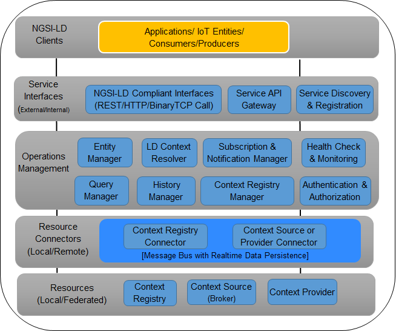

**********
基本ガイド
**********

アーキテクチャの概要
####################

Scorpio Broker は、NGSI-LD APIs のリファレンス実装です。Scorpio Broker は、NGSI-LD API 仕様に準拠するさまざまな
データコンテキスト操作用の REST API エンドポイントの実装を提供します。Scorpio Broker コンポーネントは、モジュール式の
マイクロサービス指向、スケーラブル、設計による安全性、監視/デバッグが容易、フォールトトレラント、
高可用性アーキテクチャに基づいて実装されています。NGSI-LD に基づく ScorpioBroker は、リンクトデータコンテキストの
独自の機能を提供し、各メッセージ/エンティティに含まれるデータの自己完結型 (または参照) の動的スキーマ定義
(つまりコンテキスト) を提供します。したがって、Scorpio Broker のコア処理は、さまざまなスキーマと結合された
(または設計された) さまざまなタイプのデータソースからの入力として動的なコンテキスト駆動型データを取得しても、
統合されたままになります。

Scorpio Broker の基本アーキテクチャは5つのレイヤーで構成され、最初のレイヤーはプロデューサーとコンシューマーとして
機能する Scorpio Broker クライアントで構成されます。2番目のレイヤーは、Scorpio Broker と外部世界との間のインターフェイス
として機能します。このレイヤーは、NGSI-LD 準拠のインターフェイス、サービス API ゲートウェイ、およびサービスの
ディスカバリーとレジストレーションで構成されます。第3層にはすべてのマイクロサービスが含まれ、エンティティの CRUD
操作などのタスクの大部分を担当します。第4層は、ストレージからさまざまなマイクロサービスを接続するインターフェイス
として機能します。5番目のレイヤーは、Scorpio Broker のストレージとして機能するリソースレイヤーです。

****************************
システム セットアップ ガイド
****************************

Scorpio Broker の環境をセットアップするには、次の依存関係を構成する必要があります:-

1. Server JDK.

2. Apache Kafka.

3. PostgreSQL

Windows
#######

JDK セットアップ
****************

- JDK のインストールを開始し、“Change destination folder” チェックボックスを押してから、'Install' をクリックします。

**注意:-** 推奨バージョンは JDK-11 です。Scorpio Broker は、このバージョンでのみ開発およびテストされています。

.. figure:: ../../en/source/figures/jdk-1.png

- インストールディレクトリを、フォルダ名にスペースを入れない任意のパスに変更します。

Windows に Java をインストールした後、Java インストールディレクトリを指すように JAVA_HOME 環境変数を設定する必要が
あります。

**JAVA_HOME 変数を設定**

JAVA_HOME 変数を設定するには:

1. Java がインストールされている場所を調べます。インストール中にパスを変更しなかった場合は、次のようになります。

*C:\Program Files\Java\jdk1.version*

2.

- Windows 7 では、**My Computer** を右クリックして、**Properties** > **Advanced** を選択します。

または

- Windows 8 では、**Control Panel** > **System** > **Advanced System Settings** に移動します。

3. "Environment Variables" ボタンをクリックします。

4. "System Variables" で、New をクリックします。

5. "User Variable Name" フィールドに、次のように入力します: **JAVA_HOME**

6. "User Variable Value" フィールドに、JDK パスを入力します。

(Java パスとバージョンは、使用している Kafka のバージョンによって異なる場合があります)

7. 次に、'OK' をクリックします。

8. 開いたばかりの “Environment Variables” ダイアログボックスの “System Variable” セクションでパス変数を検索します。

9. パスを編集し、下の画像のように、すでにそこに書き込まれているテキストの最後に *;%JAVA_HOME%\bin* と入力します。

- Java のインストールを確認するには、cmd.exe を開いて “java –version” と入力します。インストールした Java のバージョンが
表示されるはずです。

.. figure:: ../../en/source/figures/jdk-4.png

コマンドプロンプトが上の画像のようになっている場合は、問題ありません。それ以外の場合は、セットアップバージョンが正しい
OS アーキテクチャ (x86, x64) と一致するかどうか、または環境変数のパスが正しいかどうかを再確認する必要があります。

Kafka のセットアップ
********************

1. Kafka 構成ディレクトリに移動します。例:- **C:\kafka_2.12-2.1.0\config**

2. ファイル “server.properties” を編集します。

3. 行 "log.dirs=/tmp/kafka-logs” を見つけて “log.dir= C:\kafka_2.11-0.9.0.0\kafka-logs" に編集します。

4. ZooKeeper が他のマシンまたはクラスターで実行されている場合は、“zookeeper.connect:2181” をカスタム IP とポートに編集できます。このデモでは、同じマシンを使用しているため、変更する必要はありません。また、Kafka ポートと broker.id はこのファイルで構成できます。他の設定はそのままにしておきます。

5. Kafka はデフォルトポート 9092 で実行され、ZooKeeper のデフォルトポート 2181 に接続します。

**注意**: Kafka を実行するには、Zookeeper を最初に実行する必要があります。Kafka を閉じるときは、Kafka よりも Zookeeper
を最初に閉じる必要があります。Kafka の推奨バージョンは kafka_2.12-2.1.0 です。

Kafka サーバーの実行
********************

重要: Kafka サーバーを起動する前に、ZooKeeper インスタンスが稼働していることを確認してください。

1. Kafka インストールディレクトリに移動します: **C:\kafka_2.11-0.9.0.0\**

2. Shift キーを押しながら右クリックしてコマンドプロンプトを開き、“Open command window here” オプションを選択します。

3. 次に、**.\bin\windows\kafka-server-start.bat .\config\server.properties** と入力し、Enter キーを押します。

4. そして、新しいコマンドウィンドウに **.\bin\windows\kafka-server-start.bat .\config\server.properties** と入力し、エンターキーを押します。

PostgreSQL のセットアップ
*************************

ステップ 1) https://www.postgresql.org/download にアクセスします。

**注意**: 推奨バージョンは postgres10 です。

ステップ 2) 2つのオプションがあります:-

1. EnterpriseDB によるインタラクティブインストーラー

2. BigSQL によるグラフィカルインストーラー

BigSQL は現在、非推奨の pgAdmin version 3 をインストールしています。最新バージョン4 をインストールする EnterpriseDB
を選択することをお勧めします。

ステップ 3)

1. 目的の Postgre バージョンとオペレーティングシステムが表示されます。Scorpio Broker はこのバージョンでテストおよび開発されているため、Postgres10 を選択します。

2. "Download" ボタンをクリックすると、ダウンロードが始まります。

ステップ 4) ダウンロードした .exe を開き、インストールのようこそ画面 (welcome screen) で "Next" ボタンをクリックします。

ステップ 5) 

1. 必要に応じてインストールディレクトリを変更します。それ以外の場合はデフォルトのままにします。 

2. "Next" ボタンをクリックします。

ステップ 6)

1. システムにインストールするコンポーネントを選択できます。Stack Builder のチェックを外してもかまいません。

2. "Next" ボタンをクリックします。

ステップ 7)

1. データの場所を変更できます。

2. "Next" ボタンをクリックします。

ステップ 8)

1. スーパーユーザーのパスワードを入力します。それをメモしてください。

2. "Next" ボタンをクリックします。

ステップ 9)

1. ポート番号はデフォルトのままにします。

2. "Next" ボタンをクリックします。

ステップ 10)

1. インストール前の概要を確認してください。

2. "Next" ボタンをクリックします。

ステップ 11) "Next" ボタンをクリックします。

ステップ 12) インストールが完了すると、Stack Builder プロンプトが表示されます。

1. そのオプションのチェックを外します。より高度なチュートリアルで Stack Builder を使用します。

2. "Finish" をクリックします。

ステップ 13) PostgreSQL を起動するには、"Start" メニューに移動し、pgAdmin 4 を検索します。

ステップ 14) pgAdmin ホームページが表示されます。

ステップ 15) 左側のツリーで Servers > Postgre SQL 10 をクリックします

ステップ 16)

1. インストール時に設定したスーパーユーザーのパスワードを入力します。

2. "OK" をクリックします。

ステップ 17) You will see the Dashboard

.. figure:: ../../en/source/figures/dbconfig-2.png

PostgreSQL のインストールは以上です。

Linux
#####

JDK のセットアップ
******************

マシンに Java 環境を作成するには、JDK をインストールします。これを行うには、ターミナルを開き、次のコマンドを実行します:-

1. sudo apt-get update

2. sudo apt-get install openjdk-8-jdk

JDK がマシンに正しくインストールされていることを確認するには、ターミナルでコマンド **java -version** を実行して、JDK
のバージョンを11として返す場合は、正常に機能しています。

.. figure:: ../../en/source/figures/javaTerminal.png

Kafka のセットアップ
********************

マシンに Apache Kafka をダウンロードするには、ターミナルで次のコマンドを1つずつ実行します。

1. mkdir kafka

2. cd kafka

3. wget https://archive.apache.org/dist/kafka/2.2.0/kafka_2.12-2.2.0.tgz

4. tar -xzf kafka_2.12-2.2.0.tgz

Kafka がマシンにダウンロードされたら、次のコマンドを押して実行します。

1. kafka_2.12-2.2.0/bin/zookeeper-server-start.sh kafka_2.12-2.2.0/config/zookeeper.properties > /dev/null 2>&1 &

2. kafka_2.12-2.2.0/bin/kafka-server-start.sh kafka_2.12-2.2.0/config/server.properties > /dev/null 2>&1 &

PostgreSQL のセットアップ
*************************

マシンに PostgreSQL をダウンロードするには、ターミナルから次のコマンドを実行します。

1. sudo apt update

2. sudo apt-get install postgresql-10

3. service postgresql status

最後のコマンドは、これが図の1つと一致する場合、マシンの PostgreSQL のステータスを示します。すべてが正しくインストール
されているか、コマンドを再実行します。

.. figure:: ../../en/source/figures/postgresTerminal.png

PostgreSQL がマシンに正常にインストールされたら、データベース **ngb** を作成し、次のコマンドを実行してその役割を変更します:

1.	psql -U postgres -c "create database ngb;"

2.	psql -U postgres -c "create user ngb with password 'ngb';"

3.	psql -U postgres -c "alter database ngb owner to ngb;"

4.	psql -U postgres -c "grant all privileges on database ngb to ngb;"

5.	psql -U postgres -c "alter role ngb superuser;"

6.	sudo apt install postgresql-10-postgis-2.4

7.	sudo apt install postgresql-10-postgis-scripts

8.	sudo -u postgres psql -U postgres -c "create extension postgis;"

これで、PostgreSQL を ScorpioBoker で使用する準備が整います。
