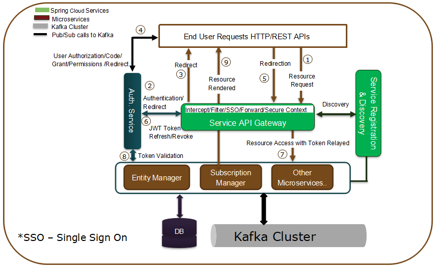

**********************
Scorpio のセキュリティ
**********************

セキュリティアーキテクチャ
##########################

Scorpio Broker システムは、ID および認証管理 (Identity & authentication management) のセキュリティにも責任を負います。
これには、Scorpio Broker セキュリティレルムでアクセスする要求、ユーザー、ロールベースで保護されたリソースの認証と認可が
含まれます。

Scorpio Broker コンポーネントおよびサービス全体にアプリケーション層のセキュリティを提供する、OAuth2.0 仕様に準拠した
新しい認証および認可サービス (Authentication & Authorization service) が導入されました。

セキュリティ - 機能リクエストフロー
###################################

1. ブラウザ/エンドユーザーは、API gateway REST interface を使用して Scorpio Broker システムに保護されているリソースリクエストを送信します。

2. API Gateway は、セキュリティ機能が有効になっているかどうかを確認します。

a. 有効になっている場合、リクエストがすでに認証されており、
既存のセッションがすでにあるかどうかを確認します。

- セッションが見つからない場合は、リクエストを認証および認可サービスに転送します。または、

- 既存のセッションが見つかった場合、認証目的で同じセッションを再利用し、リクエストをバックエンドリソースサービスにルーティングします。

b. セキュリティが有効になっていない場合は、セキュリティチェックをバイパスし、指定されたリクエストに対してリソースを
レンダリングする責任があるバックエンドリソースサービスにリクエストをルーティングします。

3. これで、リクエストが Authentication & Authorization (略して Auth) service に届くと、元のリクエスター、つまりユーザー/ブラウザーにログインフォームで応答し、リソースにアクセスするために発行された資格情報に基づいて ID を提示します。

4. そのため、ユーザーは認証情報を含むログインフォームを Auth service に送信します。Auth service は、アカウントの詳細に基づいてユーザーの資格情報を検証し、成功したログイン認証コード (auth code) と、ユーザーがリソース要求をフェッチするためにリダイレクトできる redirect URL で応答するようになりました。
 
5. ユーザー/ブラウザは redirect URL にリダイレクトするようになりました。この場合も、Auth service から受信した auth_code を含む API gateway URL です。

6. API gateway は、既存のセッションコンテキストを見つけるセッションを再度チェックしますが、今回はリクエストで auth_code を受信するため、その auth_code を使用し、ユーザーに代わってクライアントとして機能する Auth service からトークンをリクエストします。認証コード (auth code) に基づく Auth service は、すでにログインしている検証済みユーザーであることを認識し、アクセストークンを使用して API gateway に戻ります。

7. (同じセキュリティ セッション コンテキスト内で) トークンを受信すると、API gateway は、元の要求されたリソース/操作のためにバックエンドリソースサービスにリレー/ルーティングするようになりました。

8. バックエンドリソースサービスもセキュリティ機能で有効になっています (そうでない場合は、次の安全な要求に対してエラーがスローされます)。リクエストを受信し、そこからセキュリティコンテキストを読み取り、Auth service と同じように (抽出された情報に基づいて) 検証して、これが指定された権限を持つ有効なトークン/リクエストであるかどうかを確認します。Auth service の応答バックとバックエンドサービスは、ローカルセキュリティ構成とAuth service ベースのアクセス許可が一致しているかどうかを判断します。

9. アクセス許可/特権が着信要求と一致する場合、要求されたリソースでユーザー/ブラウザーに応答します。場合によっては、エラーメッセージと拒否された理由で元に戻るよりも、セキュリティ基準に一致しません。
