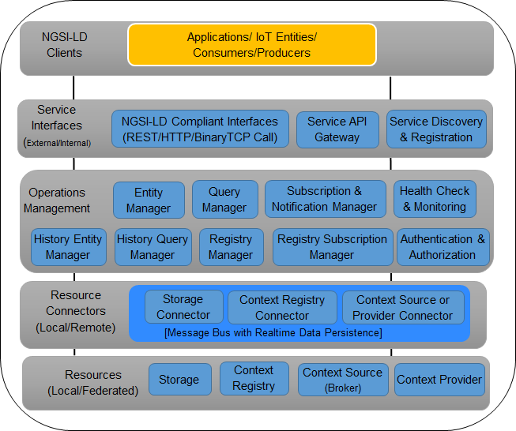
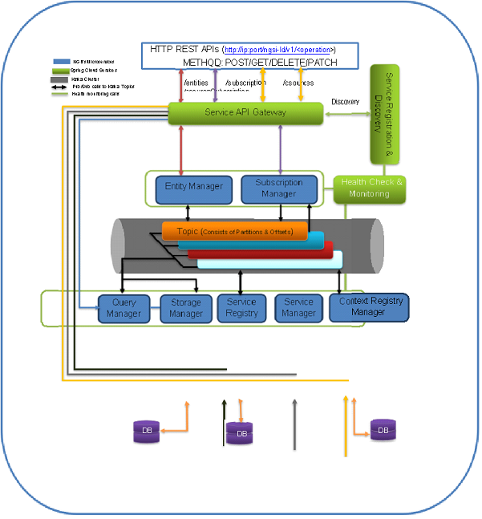

**************
アーキテクチャ
**************

デプロイメントアーキテクチャは、マイクロサービスの多くの懸念事項 (スケーリング、モニタリング、フォールトトレラント、
高可用性、セキュア、分離など) に対処する Spring Cloud フレームワークと、分散型でスケーラブルなメッセージキュー
インフラストラクチャに基づいており、IoT ドメインで通常行われている膨大な数のコンテキストリクエストのメッセージ処理で
高いパフォーマンスを提供する Kafka を活用します。

これは、外部から Scorpio Broker システムへの高レベルな操作 (POST/GET/DELETE/PATCH メソッドを使用した HTTP ベースの REST)
の要求フローをカバーしています。外部リクエストは、Scorpio Broker システムが提供できるすべてのサービスに使用される単一の
IP/port の組み合わせを公開する統合サービス API gateway イインターフェイスを介して提供されます。実際には、Scorpio Broker
の各サービスは、分散コンピューティング環境で独立したスタンドアロンユニットとして展開できるマイクロサービスとして
実装されています。API gateway は、ディスカバリーおよびレジストレーションサービス (Discovery & registration service)
を利用して、すべての着信要求を特定のマイクロサービスにルーティングします。リクエストが操作要件に基づいてマイクロサービス
に到達すると、リアルタイムストレージとメッセージキューを介し (要件に基づく) さまざまなマイクロサービス間の相互通信に
(pub/sub) Kafka トピック (メッセージキュー) を使用します。

- **Application**: エンドユーザー/ドメインアプリケーションは、Scorpio Broker を活用して、IoT インフラストラクチャに関する必要な情報を提供します。このアプリケーションは、要件に応じて、Scorpio Broker との間でコンテキスト情報をクエリ、サブスクライブ、アップデートできます。

- **Consumers**: これらは、Scorpio Broker のデータを消費する IoT エンティティまたはアプリケーションです。

- **Producers**: これらは、Scorpio Broker にコンテキストデータを生成する IoT エンティティ、コンテキストソース、または アプリケーションです。

- **Service API Gateway**: これは、REST ベースの HTTP インターフェースを介して公開された Scorpio Broker システムの内部サービスにアクセスするための外部世界の Proxy gateway です。Scorpio Broker に関連するすべての内部サービスには、この Service API gateway を介して、単一の (通常は静的な) IP とポートを使用し、URL のサービス名を拡張してアクセスできます。したがって、ユーザーは、動的に変更されることが多いすべてのサービスの IP とポートを管理 (または学習または使用) する必要はありません。これにより、特に複数のサービス (またはマイクロサービス) が1つのシステムで実行されている場合に、作業が楽になります。これは、すべてのバックエンドサービスに Proxy gateway (つまり、Service API Gateway) を使用することで簡単に解決できます。

- **Rest Interface**: これらは、Scorpio Broker で特定の操作を実行するために消費する外部エンティティ/アプリケーションの HTTP ベースのインターフェースです。外部インターフェースは Service API gateway を介して表示され、要求された各サービスへの内部インターフェースのマッピングは、Service Discovery & Registration モジュールを介して検出されます。

- **Service Discovery & Registration**: このコンポーネントを使用すると、任意のサービス (Webサービス/マイクロサービス) をレジストレーションできるため、このコンポーネントのディスカバリー機能を使用するクライアントは、要求の送信先となるサービスインスタンスの場所を特定できます。つまり、Service Discovery & Registration は、サービス、そのインスタンス、およびその場所のデータベースを実装します。サービスインスタンスは、起動時にサービスレジストリに登録され、シャットダウン時に登録は解除されます。サービスのクライアントは、サービスの利用可能なインスタンスを検出するサービスレジストリにクエリを実行します。サービスレジストリは、サービスインスタンスの Health check API を呼び出して、リクエストを処理できることを確認する場合もあります。

- **Entity Manager**: このコンポーネントは、Scorpio Broker の他のコンポーネントを使用して、エンティティに関連するすべての CRUD 操作を処理します。

- **LD Context Resolver**: このコンポーネントは、Scorpio Broker の他のコンポーネントによるさらなる処理のために、JSON-LD @context に基づいて NGSI-LD ドキュメントを拡張する役割を果たします。

- **Subscription & Notification Manager**: このコンポーネントは、エンティティおよび/または csource subscription & notification に関連する CRUD 操作の処理を担当します。

- **Query Manager**: このコンポーネントは、Scorpio Broker への単純または複雑なクエリ (ジオクエリなど) を処理します。

- **Storage Manager**: このコンポーネントは、メッセージブローカーからデータをフェッチし、それらを関連するスキーマ形式に変換して、DB テーブルに保持する役割を果たします。さらに、このマネージャーは、DB への複雑なクエリ (ジオクエリやクロスドメイン エンティティ コンテキスト リレーションシップ クエリなど) のインターフェイスも提供します。

- **Context Registry Manager**: このコンポーネントは、csource registration/query/subscription の CRUD 操作用のインターフェイスを提供する役割を果たします。

- **Health Check & Monitoring**: このコンポーネントは、実行中のサービスとインフラストラクチャの状態を監視する役割を果たします。

- **Message Bus Handler**: Scorpio Broker のすべてのモジュールは、モジュール間でメッセージを交換するためにバスと通信する必要がある場合があります。このインターフェースは、メッセージバスハンドラーによって提供されます。

- **Storage Connectors**: Scorpio Broker は、特定の情報をさまざまな DB 形式で保存する必要があります。したがって、ストレージコネクタ (任意のタイプのメッセージブローカー方法論を使用) は、それらのストレージシステム (ローカルまたはリモートに存在する可能性があります) に接続する方法を提供します。たとえば、エンティティ情報は、MySQL、PostgreSQL、Bigdata などのさまざまなタイプのストレージシステムに保存/ストリーミングできます。これらのコネクタは、ストレージの復元力の目的で実装することもできます。

- **Context Registry Connector**: Scorpio Broker は、登録されたコンテキストソース (ブローカー/プロバイダー) とそれらがサポートするデータモデルのタイプについて知るために、コンテキストレジストリと通信する必要があります。コンテキストレジストリコネクタを使用すると、メッセージブローカメカニズムは、フェデレーションモードでローカルまたはリモートで実行されている可能性のあるコンテキストレジストリに接続できます。

- **Storage**:これは、データが永続化される実際のストレージ (Postgres/Postgis など) です。

- **Context Registry**: これは、コンテキストソース/プロデューサーのレジストレーションを保存する責任があるコンポーネントです。

*****************************
デプロイメントアーキテクチャ
*****************************

このセクションでは、さまざまなテクノロジースタックを使用している Scorpio Broker のデプロイメントアーキテクチャについて
説明します。

デプロイメントアーキテクチャは、マイクロサービスの多くの懸念事項 (スケーリング、モニタリング、フォールトトレラント、
高可用性、セキュア、分離など) に対処する Spring Cloud フレームワークと、分散型でスケーラブルなメッセージキュー
インフラストラクチャに基づいており、IoT ドメインで通常行われている膨大な数のコンテキストリクエストのメッセージ処理で
高いパフォーマンスを提供する Kafka を活用します。デプロイメントアーキテクチャは、外部から Scorpio Broker システムへの
高レベルな操作 (POST/GET/DELETE/PATCH メソッドを使用した HTTP ベースの REST) の要求フローをカバーします。
外部リクエストは、Scorpio Broker システムが提供できるすべてのサービスに使用される単一の IP/port の組み合わせを公開する
Unified service API gateway interface を介して提供されます。実際には、Scorpio Broker の各サービスは、
分散コンピューティング環境で独立したスタンドアロンユニットとして展開できるマイクロサービスとして実装されます。その
API gateway は、Discovery & registration service を利用して、すべての着信要求を特定のマイクロサービスにルーティング
します。リクエストが操作要件に基づいてマイクロサービスに到達すると、リアルタイムストレージとメッセージキューを介した
(要件に基づく) さまざまなマイクロサービス間の相互通信 (要件に基づく) に (pub / sub) Kafkaトピック (メッセージキュー)
を使用します。
